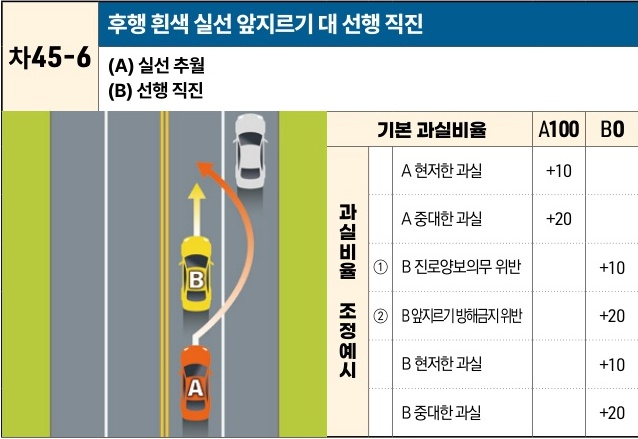

자동차사고 과실비율 인정기준 | 제3편 사고유형별 과실비율 적용기준 408

| 차45-6 | 후행 흰색 실선 앞지르기 대 선행 직진                                                                                                                                                                                                                                                                                |                |          |     |   |
| ----- | ---------------------------------------------------------------------------------------------------------------------------------------------------------------------------------------------------------------------------------------------------------------------------------------------------- | -------------- | -------- | --- | - |
|       | (A) 실선 추월 (B) 선행 직진                                                                                                                                                                                                                                                                              |                |          |     |   |
|       | \[The image shows a diagram of a two-lane road with a solid white line between lanes. A red car (A) is behind a yellow car (B) in the same lane. Car A crosses the solid white line to the left lane to overtake car B and then attempts to merge back in front of car B, resulting in a collision.] | 기본 과실비율        | A100     | B0  |   |
|       |                                                                                                                                                                                                                                                                                                      | 과실비율 조정예시      | A 현저한 과실 | +10 |   |
|       |                                                                                                                                                                                                                                                                                                      | A 중대한 과실       | +20      |     |   |
|       |                                                                                                                                                                                                                                                                                                      | ① B 진로양보의무 위반  |          | +10 |   |
|       |                                                                                                                                                                                                                                                                                                      | ② B 앞지르기방해금지위반 |          | +20 |   |
|       |                                                                                                                                                                                                                                                                                                      | B 현저한 과실       |          | +10 |   |
|       |                                                                                                                                                                                                                                                                                                      | B 중대한 과실       |          | +20 |   |

※사고발생, 손해확대와의 인과관계를 감안하여 기본 과실비율을 가(+), 감(-) 조정 가능합니다.
※舊 252-1 기준

### 사고 상황
* 동일 방향, 동일 차로로 진행하던 양 차량 중 후행하던 A차량이 진로변경이 금지되어 있는 백색 실선구간에서 진로변경을 하여 선행차량인 B차량을 추월하여 선행차량 앞으로 다시 진로변경(앞지르기)을 하는 A차량과 자신의 차로에서 계속 직진 중인 B차량이 충돌한 사고이다.

### 기본 과실비율 해설
* A차량은 도로교통법 제19조 제3항에 정한 진로변경방법 및 동법 제21조에 정한 앞지르기 방법을 모두 위반하였을 뿐만 아니라 진로변경이 금지되어 있는 흰색 실선구간에서 선행 차량인 B차량을 추월하여 그 앞으로 진로변경을 하다가 B차량을 충돌한 사고이므로 A차량의 일방과실로 보아 양 차량의 기본 과실비율을 100:0으로 정한다.

제2장. 자동차와 자동차(이륜차 포함)의 사고
