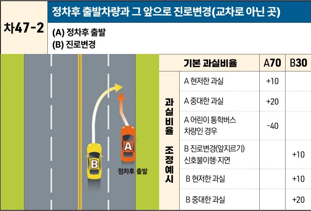

자동차사고 과실비율 인정기준 | 제3편 사고유형별 과실비율 적용기준 416 **목차**

| 차47-2                           | 정차후 출발차량과 그 앞으로 진로변경(교차로 아닌 곳) |
| ------------------------------- | ------------------------------ |
| \*\*(A) 정차후 출발 (B) 진로변경\*\* |                                |

[The image shows a diagram of a two-lane road. Vehicle A (red) is starting to move from a parked position on the right side of the road. Vehicle B (yellow) is in the left lane and is changing lanes to the right, moving in front of Vehicle A. An orange arrow indicates Vehicle A's forward movement, and a yellow curved arrow indicates Vehicle B's lane change.]

| 과실비율 조정예시 | 기본 과실비율               | A70 | B30 |
| --------- | --------------------- | --- | --- |
| 과실비율 조정예시 | A 현저한 과실              | +10 |     |
|           | A 중대한 과실              | +20 |     |
|           | A 어린이 통학버스 차량인 경우     | -40 |     |
|           | B 진로변경(앞지르기) 신호불이행·지연 |     | +10 |
|           | B 현저한 과실              |     | +10 |
|           | B 중대한 과실              |     | +20 |

※사고발생, 손해확대와의 인과관계를 감안하여 기본 과실비율을 가(+), 감(-) 조정 가능합니다.

### 사고 상황
* 직선도로에서 B차량이 오른쪽 차로에 정차중인 A차량 앞으로 진로변경하던 중 출발하는 A차량과 충돌한 사고이다.

### 기본 과실비율 해설
* 도로교통법 제21조 제4항에 따라 정차 후 출발하는 A차량은 B차량의 앞지르기를 방해하여서는 아니 될 주의의무가 있고, 특히 후행 B차량은 A차량의 정차사실을 신뢰한 채 운행하던 중이므로 정차한 후 전방 및 좌우주시의무를 위반한 채 만연히 출발하는 선행 A차량의 과실이 중하다고 할 것이지만, B차량도 정차 차량의 동태를 살필 주의의무가 인정되는 점을 감안하여 양 차량의 기본과실을 70:30으로 정한다.

제2장. 자동차와 자동차(이륜차 포함)의 사고
