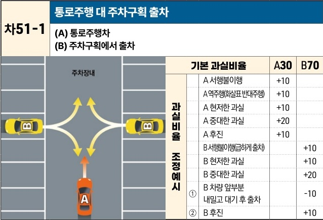

자동차사고 과실비율 인정기준 | 제3편 사고유형별 과실비율 적용기준 425 목차

## 라. 기타 유형의 사고
### (1) 주차장 사고 [차51]

| 차51-1                                                             | 통로주행 대 주차구획 출차 (A) 통로주행차(B) 주차구획에서 출차 | 통로주행 대 주차구획 출차 (A) 통로주행차(B) 주차구획에서 출차 | 통로주행 대 주차구획 출차 (A) 통로주행차(B) 주차구획에서 출차 | 통로주행 대 주차구획 출차 (A) 통로주행차(B) 주차구획에서 출차 |
| ----------------------------------------------------------------- | ----------------------------------------- | ----------------------------------------- | ----------------------------------------- | ----------------------------------------- |
| 주차장내  (그림 설명: 주차장 통로를 직진하는 A차량과 주차구역에서 통로로 진입하려는 B차량의 상황) | 기본 과실비율                                   |                                           | A30                                       | B70                                       |
|                                                                   | 과실비율 조정예시                                 | A 서행불이행                                   | +10                                       |                                           |
|                                                                   |                                           | A 역주행(화살표 반대주행)                           | +10                                       |                                           |
|                                                                   |                                           | A 현저한 과실                                  | +10                                       |                                           |
|                                                                   |                                           | A 중대한 과실                                  | +20                                       |                                           |
|                                                                   |                                           | A 후진                                      | +10                                       |                                           |
|                                                                   |                                           | B 서행불이행(급하게 출차)                           |                                           | +10                                       |
|                                                                   |                                           | B 현저한 과실                                  |                                           | +10                                       |
|                                                                   |                                           | B 중대한 과실                                  |                                           | +20                                       |
|                                                                   |                                           | ① B 차량 앞부분 내밀고 대기 후 출차                    |                                           | -10                                       |
|                                                                   |                                           | ② B 후진                                    |                                           | +10                                       |

※사고발생, 손해확대와의 인과관계를 감안하여 기본 과실비율을 가(+), 감(-) 조정 가능합니다.
※舊 244 기준

#### 사고 상황
* 주차장 내에서 통행로를 주행하는 A차량과 주차구역에서 전진 내지 후진하여 통행로로 출차하는 B차량이 충돌한 사고이다.

#### 기본 과실비율 해설
* 주차장 내에서 통행로를 진행 중인 차량과 주차구역에서 주차하였다가 통행로로 출차하는 차량 사이의 사고로서 도로교통법 제18조 제3항의 도로가 아닌 장소에서 도로로 진입 중 사고와 유사하므로 차44-1 기준을 준용하되, 주차구역에서 출차하는 차량을 충분히 예상할 수 있는 주차장이라는 특성을 감안하여 B차량의 과실을 10% 감산하여 양 차량의 기본 과실비율을 30:70으로 정하였다.

제2장. 자동차와 자동차(이륜차 포함)의 사고
