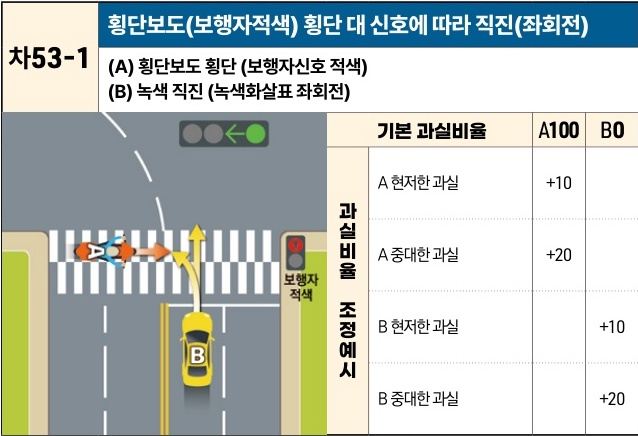

자동차사고 과실비율 인정기준 | 제3편 사고유형별 과실비율 적용기준 435

# (3) 횡단보도 횡단 차량 [차53]

| 차53-1                                                                                                                                                                                                                                                                                     | 횡단보도(보행자적색) 횡단 대 신호에 따라 직진(좌회전) (A) 횡단보도 횡단 (보행자신호 적색)(B) 녹색 직진 (녹색화살표 좌회전) | 횡단보도(보행자적색) 횡단 대 신호에 따라 직진(좌회전) (A) 횡단보도 횡단 (보행자신호 적색)(B) 녹색 직진 (녹색화살표 좌회전) | 횡단보도(보행자적색) 횡단 대 신호에 따라 직진(좌회전) (A) 횡단보도 횡단 (보행자신호 적색)(B) 녹색 직진 (녹색화살표 좌회전) | 횡단보도(보행자적색) 횡단 대 신호에 따라 직진(좌회전) (A) 횡단보도 횡단 (보행자신호 적색)(B) 녹색 직진 (녹색화살표 좌회전) |
| ----------------------------------------------------------------------------------------------------------------------------------------------------------------------------------------------------------------------------------------------------------------------------------------- | ------------------------------------------------------------------------------- | ------------------------------------------------------------------------------- | ------------------------------------------------------------------------------- | ------------------------------------------------------------------------------- |
| \[The image shows a diagram of a traffic accident at a crosswalk. Vehicle A (a motorcycle) is crossing the crosswalk while the pedestrian signal is red. Vehicle B (a car) is proceeding straight through the intersection on a green light. The two vehicles are on a collision course.] | 기본 과실비율 A100 B0                                                                 |                                                                                 |                                                                                 |                                                                                 |
|                                                                                                                                                                                                                                                                                           | 과실비율 조정예시 A 현저한 과실 +10                                                          |                                                                                 |                                                                                 |                                                                                 |
|                                                                                                                                                                                                                                                                                           |                                                                                 | A 중대한 과실 +20                                                                    |                                                                                 |                                                                                 |
|                                                                                                                                                                                                                                                                                           |                                                                                 | B 현저한 과실 +10                                                                    |                                                                                 |                                                                                 |
|                                                                                                                                                                                                                                                                                           |                                                                                 | B 중대한 과실 +20                                                                    |                                                                                 |                                                                                 |

※사고발생, 손해확대와의 인과관계를 감안하여 기본 과실비율을 가(+), 감(-) 조정 가능합니다.

### 사고 상황
* 신호등이 설치된 교차로에서 횡단보도 보행자 적색신호에 횡단하는 A이륜차량과 신호에 따라 정상 직진(좌회전)하는 B차량이 충돌한 사고이다. A차량이 승용차인 경우도 준용한다.

### 기본 과실비율 해설
* 신호기가 있는 교차로에서 신호는 양 차량 운전자가 신뢰하는 것으로, B차량은 A차량이 신호를 위반하여 보행자 횡단보도를 보행자 적색신호에 횡단할 것을 예상하고 주의해야 할 이유가 없으므로 A차량의 일방과실(100:0)로 정한다.

### 수정요소(인과관계를 감안한 과실비율 조정) 해설
* 양 차량의 현저한 과실 내지 중과실은 양 차량 진입 시점, 양 차량 진행 속도, 기타 충격부위 등 여러 사정을 비교하여 가감산할 수 있다.

제2장. 자동차와 자동차(이륜차 포함)의 사고
