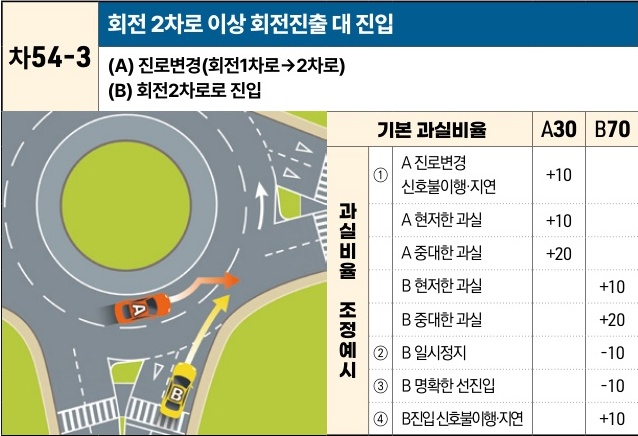

자동차사고 과실비율 인정기준 | 제3편 사고유형별 과실비율 적용기준 444

| 차54-3                                                                                                                                                                                                                                                                                                                   | 회전 2차로 이상 회전진출 대 진입                   |                 |     |     |
| ----------------------------------------------------------------------------------------------------------------------------------------------------------------------------------------------------------------------------------------------------------------------------------------------------------------------- | ------------------------------------- | --------------- | --- | --- |
|                                                                                                                                                                                                                                                                                                                         | (A) 진로변경(회전1차로→2차로) (B) 회전2차로로 진입 |                 |     |     |
| \[The image shows a diagram of a two-lane roundabout. Vehicle A is in the inner lane (lane 1) attempting to exit by changing to the outer lane (lane 2). Vehicle B is entering the roundabout into the outer lane (lane 2). A collision occurs at the point where A's lane change path intersects with B's entry path.] | 기본 과실비율                               | A30             | B70 |     |
| 과실비율 조정예시                                                                                                                                                                                                                                                                                                               | ①                                     | A 진로변경 신호불이행·지연 | +10 |     |
|                                                                                                                                                                                                                                                                                                                         |                                       | A 현저한 과실        | +10 |     |
|                                                                                                                                                                                                                                                                                                                         |                                       | A 중대한 과실        | +20 |     |
|                                                                                                                                                                                                                                                                                                                         |                                       | B 현저한 과실        |     | +10 |
|                                                                                                                                                                                                                                                                                                                         |                                       | B 중대한 과실        |     | +20 |
|                                                                                                                                                                                                                                                                                                                         | ②                                     | B 일시정지          |     | -10 |
|                                                                                                                                                                                                                                                                                                                         | ③                                     | B 명확한 선진입       |     | -10 |
|                                                                                                                                                                                                                                                                                                                         | ④                                     | B진입신호불이행·지연     |     | +10 |

※사고발생, 손해확대와의 인과관계를 감안하여 기본 과실비율을 가(+), 감(-) 조정 가능합니다.
※舊 266, 399-4 기준

### 사고 상황
* 2차로형 교차로에서 내부 1차로를 주행하다 2차로로 진출하려는 A차량과 회전교차로로 진입하려는 B차량과의 사고이다.
* 3차로 이상 회전교차로에서도 준용된다.

### 기본 과실비율 해설
* 회전교차로의 경우 도로교통법 제25조의2 제2항에 따라 진입차량은 진입 시 양보 의무가 명시적으로 규정되어 있어 회전차량에 통행우선권이 주어져 있으나, 회전차량도 진입하는 차량이 있는지 주의하며 진로변경해야 하므로, 양 차량의 기본 과실비율을 30:70으로 정한다.

### 수정요소(인과관계를 감안한 과실비율 조정) 해설
* 현저한 과실과 중대한 과실은 제3편 제2장 3. 수정요소의 해설 부분을 참조한다.

제2장. 자동차와 자동차(이륜차 포함)의 사고
