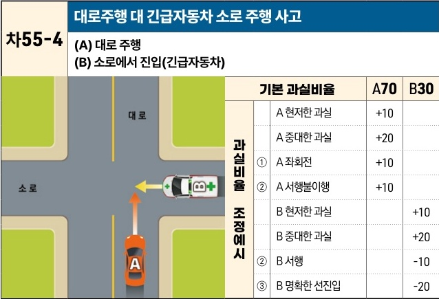

자동차사고 과실비율 인정기준 | 제3편 사고유형별 과실비율 적용기준 465

| 차55-4 | 대로주행 대 긴급자동차 소로 주행 사고                            |
| ----- | ------------------------------------------------ |
|       | \*\*(A) 대로 주행\*\* \*\*(B) 소로에서 진입(긴급자동차)\*\* |

[The image shows a diagram of a T-junction intersection. Vehicle A (orange car) is traveling straight on a main road (대로). Vehicle B (emergency vehicle with flashing lights) is entering the main road from a side road (소로) on the right, intending to turn left or cross.]

|   | 과실비율 조정예시 | 과실비율 조정예시 | 기본 과실비율 | A70 | B30 |
| - | --------- | --------- | ------- | --- | --- |
| ① | A 현저한 과실  | +10       |         |     |     |
|   | A 중대한 과실  | +20       |         |     |     |
|   | A 좌회전     | +10       |         |     |     |
|   | ②         | A 서행불이행   | +10     |     |     |
|   |           | B 현저한 과실  |         | +10 |     |
|   | B 중대한 과실  |           | +20     |     |     |
| ② | B 서행      |           | -10     |     |     |
| ③ | B 명확한 선진입 |           | -20     |     |     |

※사고발생, 손해확대와의 인과관계를 감안하여 기본 과실비율을 가(+), 감(-) 조정 가능합니다.
※舊 270 기준

### 사고 상황
* 신호등 없는 대소로가 교차하는 교차로에서, 긴급자동차 B차량은 소로에서 대로로 진입하였고, A차량은 대로에서 직진이나 좌회전 주행하던 중 충돌한 사고이다.

### 기본 과실비율 해설
* 운전자는 도로교통법상 교차로나 그 부근에서 긴급자동차 접근시 일시정지 할 의무가 있고 긴급자동차는 교차로 통행우선권이 있다.(제29조 제4항)
* A차량이 대로를 주행 중이라 하더라도 도로교통법에 따른 양보를 하지 아니한 과실이 중대하나, B차량도 동법 제29조 제3항에 따른 주의의무가 있는 점을 고려하여 양 차량의 기본 과실비율을 70:30으로 정한다.

제2장. 자동차와 자동차(이륜차 포함)의 사고
