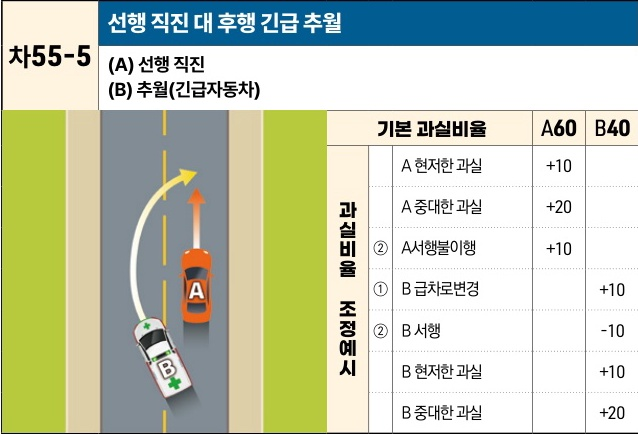

자동차사고 과실비율 인정기준 | 제3편 사고유형별 과실비율 적용기준 469

| 차55-5                                       | 선행 직진 대 후행 긴급 추월 |
| ------------------------------------------- | ---------------- |
| \*\*(A) 선행 직진\*\* \*\*(B) 추월(긴급자동차)\*\* |                  |

[The image shows a diagram of a two-lane road with a dashed yellow center line. Vehicle A (orange car) is driving straight in the right lane. Vehicle B (white emergency vehicle with a green cross) is behind vehicle A and is moving to the left lane to overtake vehicle A, indicated by a curved yellow arrow.]

| 과실비율 조정예시A 중대한 과실 +20 ② A서행불이행 +10 ① B 급차로변경 ② B 서행 B 현저한 과실 B 중대한 과실 | 기본 과실비율 A60 B40 A 현저한 과실 +10 A 중대한 과실 +20 ② A서행불이행 +10 +10 -10 +10 +20 | 기본 과실비율 A60 B40 A 현저한 과실 +10 A 중대한 과실 +20 ② A서행불이행 +10 +10 -10 +10 +20 |
| ----------------------------------------------------------------------------------------- | -------------------------------------------------------------------------------------------------- | -------------------------------------------------------------------------------------------------- |

※사고발생, 손해확대와의 인과관계를 감안하여 기본 과실비율을 가(+), 감(-) 조정 가능합니다.
※舊 271 기준

### 사고 상황
* 직선도로에서 선행 직진하는 A차량을 긴급자동차인 B차량이 긴급상황으로 추월하다가 발생한 사고이다.

### 기본 과실비율 해설
* A차량은 도로교통법 제29조 제4항에 따라 긴급자동차에 진로를 양보해야 하는 의무가 있다. B차량은 긴급자동차의 우선통행에 대한 요건을 갖추어 주행한 것으로 긴급자동차는 도로교통법 제22조에서 금지하고 있는 앞지르기가 허용된다(도로교통법 제 30조 9호). 다만, B차량도 동법 제29조 제3항에 따른 주의의무가 있는 점을 고려하여 기본 과실비율을 60:40으로 정하였다.

### 수정요소(인과관계를 감안한 과실비율 조정) 해설
* 긴급자동차는 도로교통법 제30조에 따라 ①속도 제한(다만, 17조에 따라 긴급자동차에 대하여 속도 제한한 경우에는 예외 있음), ②앞지르기 금지, ③끼어들기 금지, ④신호위반,

제2장. 자동차와 자동차(이륜차 포함)의 사고
