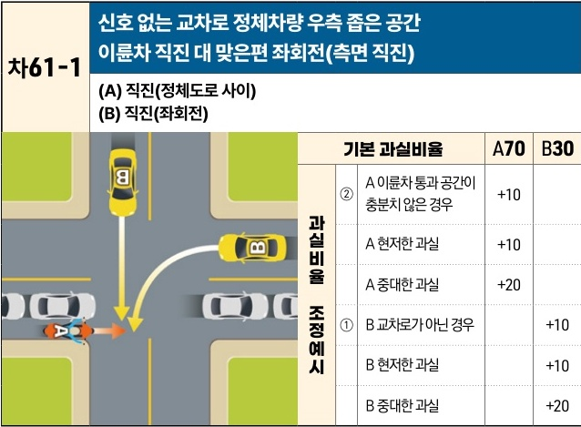

자동차사고 과실비율 인정기준 | 제3편 사고유형별 과실비율 적용기준 481

# 마. 자동차 대 이륜차 특수유형

| 차61-1                                                                                                                                                                                                                                                                                                              | 신호 없는 교차로 정체차량 우측 좁은 공간이륜차 직진 대 맞은편 좌회전(측면 직진) (A) 직진(정체도로 사이)(B) 직진(좌회전) | 신호 없는 교차로 정체차량 우측 좁은 공간이륜차 직진 대 맞은편 좌회전(측면 직진) (A) 직진(정체도로 사이)(B) 직진(좌회전) | 신호 없는 교차로 정체차량 우측 좁은 공간이륜차 직진 대 맞은편 좌회전(측면 직진) (A) 직진(정체도로 사이)(B) 직진(좌회전) | 신호 없는 교차로 정체차량 우측 좁은 공간이륜차 직진 대 맞은편 좌회전(측면 직진) (A) 직진(정체도로 사이)(B) 직진(좌회전) | 신호 없는 교차로 정체차량 우측 좁은 공간이륜차 직진 대 맞은편 좌회전(측면 직진) (A) 직진(정체도로 사이)(B) 직진(좌회전) |
| ------------------------------------------------------------------------------------------------------------------------------------------------------------------------------------------------------------------------------------------------------------------------------------------------------------------ | ----------------------------------------------------------------------------- | ----------------------------------------------------------------------------- | ----------------------------------------------------------------------------- | ----------------------------------------------------------------------------- | ----------------------------------------------------------------------------- |
| \[The image shows a diagram of a T-junction intersection. Vehicle A (a motorcycle) is traveling straight through a narrow space on the right side of stationary/congested vehicles. Vehicle B (a car) is turning left from the opposite direction through a gap in the congested traffic, leading to a collision.] | 기본 과실비율 \[thead] A70 \[thead] B30                                             |                                                                               |                                                                               |                                                                               |                                                                               |
|                                                                                                                                                                                                                                                                                                                    | 과실비율 조정예시 ②                                                                   | A 이륜차 통과 공간이 충분치 않은 경우 +10                                                    |                                                                               |                                                                               |                                                                               |
|                                                                                                                                                                                                                                                                                                                    |                                                                               | A 현저한 과실 +10                                                                  |                                                                               |                                                                               |                                                                               |
|                                                                                                                                                                                                                                                                                                                    |                                                                               | A 중대한 과실 +20                                                                  |                                                                               |                                                                               |                                                                               |
|                                                                                                                                                                                                                                                                                                                    |                                                                               | ①                                                                             | B 교차로가 아닌 경우 +10                                                              |                                                                               |                                                                               |
|                                                                                                                                                                                                                                                                                                                    |                                                                               | B 현저한 과실 +10                                                                  |                                                                               |                                                                               |                                                                               |
|                                                                                                                                                                                                                                                                                                                    |                                                                               | B 중대한 과실 +20                                                                  |                                                                               |                                                                               |                                                                               |

※사고발생, 손해확대와의 인과관계를 감안하여 기본 과실비율을 가(+), 감(-) 조정 가능합니다.
※舊 376 기준

### 사고 상황
* 신호기에 의해 교통정리가 이루어지고 있지 않고 교차로에서 차량 정체 중인 차량들의 우측과 차·보도의 경계선 또는 차도 우측 가장자리선과의 사이를 이용하여 직진하는 A이륜차와 같은 도로 맞은편 방향에서 좌회전을 하거나 또는 교차로에서 직진하여 정체 차량들 사이를 빠져나가려는 B차량이 충돌한 사고이다.

### 기본 과실비율 해설
* A이륜차가 안전운전의무를 위반하여 정체차량들의 우측 공간을 이용하며 무리하게 교차로에 진입한 과실이 매우 크나, 차량 정체 중인 상황에서 정체차량들 사이로 직진 또는 좌회전하여 신호기 없는 교차로를 통과하려는 B차량에도 주의의무가 있다는 점, 이륜차는 차량에 비하여 가해의 위험성이 상대적으로 낮으며, 사고 시 전도의 위험성이 높고 급정차하기가 어려운 점을 감안하여 양측의 기본 과실비율을 70:30으로 정하였다.

제2장. 자동차와 자동차(이륜차 포함)의 사고
