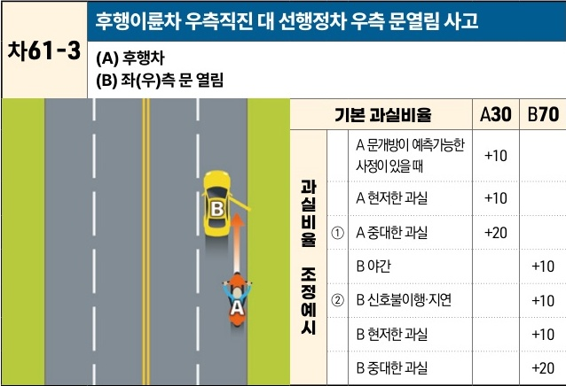

자동차사고 과실비율 인정기준 | 제3편 사고유형별 과실비율 적용기준 485

| 차61-3                                      | 후행이륜차 우측직진 대 선행정차 우측 문열림 사고 |
| ------------------------------------------ | --------------------------- |
| \*\*(A) 후행차\*\* \*\*(B) 좌(우)측 문 열림\*\* |                             |

|           | 기본 과실비율 | 기본 과실비율               | A30        | B70 |     |
| --------- | ------- | --------------------- | ---------- | --- | --- |
| 과실비율 조정예시 | ①       | A 문개방이 예측가능한 사정이 있을 때 | +10        |     |     |
|           |         |                       | A 현저한 과실   | +10 |     |
|           |         |                       | A 중대한 과실   | +20 |     |
|           | ②       | B 야간                  |            | +10 |     |
|           |         |                       | B 신호불이행·지연 |     | +10 |
|           |         |                       | B 현저한 과실   |     | +10 |
|           |         |                       | B 중대한 과실   |     | +20 |

※사고발생, 손해확대와의 인과관계를 감안하여 기본 과실비율을 가(+), 감(-) 조정 가능합니다.
※舊 395(나) 기준

### 사고 상황
* 도로에서 후행하여 직진하는 A이륜차와 도로 우측에 정차하여 좌(우)측 문을 개방한 B차량의 좌(우)측 문과 충돌한 사고이다.

### 기본 과실비율 해설
* 차량은 도로의 중앙을 기준으로 우측 부분에 정차하여야 하고 보도는 차량의 우측 문쪽에 설치되어 있기 때문에, 전방에 정차중인 B차량에서 탑승객이 내리는 경우 좌측문보다는 우측문이 개방될 가능성이 높다는 점을 감안할 때, B차량의 우측으로 진행하여 사고위험을 높인 A이륜차의 과실을 10% 높여서 양측의 기본 과실비율을 30:70으로 정하였다.

### 수정요소(인과관계를 감안한 과실비율 조정) 해설
① 차량의 우측 사이의 폭 또는 간격이 매우 좁아 통상 그곳을 통행하는 것이 예측하기 어려운 상태임에도 무리하게 주행한 경우 등은 중대한 과실로 보아 A이륜차의 과실을 20%까지 가산할 수 있다.

제2장. 자동차와 자동차(이륜차 포함)의 사고
