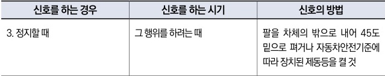

자동차사고 과실비율 인정기준 | 제3편 사고유형별 과실비율 적용기준 486

② 도로교통법 제38조에 따라 정지신호는 후방차량의 전방주시의무 위반의 기초로서 중요한 의미를 가지기 때문에, 정지신호 불이행 또는 지연의 경우 B차량의 과실을 10%까지 가산할 수 있다.

### <mark>활용시 참고 사항</mark>
* ◉ 승객에 대한 사고에 대해서는 본 기준을 적용하지 아니한다.

### <mark>관련 법규</mark>
**◉ 도로교통법 제49조(모든 운전자의 준수사항 등)**
① 모든 차 또는 노면전차의 운전자는 다음 각 호의 사항을 지켜야 한다
7. 운전자는 안전을 확인하지 아니하고 차 또는 노면전차의 문을 열거나 내려서는 아니 되며, 동승자가 교통의 위험을 일으키지 아니하도록 필요한 조치를 할 것

**◉ 도로교통법 제38조(차의 신호)**
① 모든 차의 운전자는 좌회전·우회전·횡단·유턴·서행·정지 또는 후진을 하거나 같은 방향으로 진행하면서 진로를 바꾸려고 하는 경우와 회전교차로에 진입하거나 회전교차로에서 진출하는 경우에는 손이나 방향지시기 또는 등화로써 그 행위가 끝날 때까지 신호를 하여야 한다.

**◉ 도로교통법 시행령 별표 2(신호의 시기 및 방법 [제21조 관련])**

| 신호를 하는 경우 | 신호를 하는 시기   | 신호의 방법                                             |
| --------- | ----------- | -------------------------------------------------- |
| 3. 정지할 때  | 그 행위를 하려는 때 | 팔을 차체의 밖으로 내어 45도 밑으로 펴거나 자동차안전기준에 따라 장치된 제동등을 켤 것 |

### <mark>참고 판례</mark>
**◉ 서울고등법원 1993. 12. 22. 선고 93나26122 판결**
주간에 주택가 골목길에서 선행하던 B차량이 골목길 중앙 부근에 이르러 후방주시의무를 태만히 한 채 완전히 정차하지 않은 상태에서 조수석에 타고 있는 일행을 내리게 한 과실로, 선행 B차량의 동태를 제대로 살피지 아니한 채 B차량의 우측에 근접하여 후행하고 있던 A(이륜차)를 B차량 우측 앞문짝 부분으로 충격하여 상해를 입게 한 사고: B과실 70

제2장. 자동차와 자동차(이륜차 포함)의 사고
