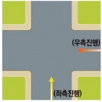

자동차사고 과실비율 인정기준 | 제3편 사고유형별 과실비율 적용기준 005 **목차**

> **자전거 이용 활성화에 관한 법률 제2조**
> 1. “자전거”란 사람의 힘으로 페달이나 손페달을 사용하여 움직이는 구동장치(驅動裝置)와 조향장치(操向裝置) 및 제동장치(制動裝置)가 있는 바퀴가 둘 이상인 차로서 행정안전부령으로 정하는 크기와 구조를 갖춘 것을 말한다.
> 1의2. “전기자전거”란 자전거로서 사람의 힘을 보충하기 위하여 전동기를 장착하고 다음 각 목의 요건을 모두 충족하는 것을 말한다.
> 가. 페달(손페달을 포함한다)과 전동기의 동시 동력으로 움직이며, 전동기만으로는 움직이지 아니할 것
> 나. 시속 25킬로미터 이상으로 움직일 경우 전동기가 작동하지 아니할 것
> 다. 부착된 장치의 무게를 포함한 자전거의 전체 중량이 30킬로그램 미만일 것

### **(2) 동일폭 교차로, 대로/소로 교차로**

- 도로폭의 크기 여부에 따라 과실뿐 아니라 가해자 및 피해자의 구분이 달라질 수 있으므로 도로폭의 크기 여부는 매우 중요한 판단 요소이다.

- 판례(대법원 1997. 6. 27., 선고, 97다14187)에 의거, 대로와 소로 구분은 ①엄격하게 적용되어야 하며, ②진행한 도로를 기준으로 하고, ③계측으로 구분할 것이 아니라 운전자가 일견 분별할 수 있어야 한다.

> **대법원 1997. 6. 27., 선고, 97다14187**
> 자기 차량이 통행하고 있는 도로의 폭보다 교차하는 도로의 폭이 넓은 지 여부는 통행 우선순위를 결정하는 중요한 기준이 되므로 이를 엄격히 해석·적용할 것이 요구되는 한편, 차량이 교차로를 통행하는 경우 그 통행하고 있는 도로와 교차하는 도로의 폭의 차가 근소한 때에는 눈의 착각 등에 의하여 그 어느 쪽이 넓은지를 곧바로 식별하기 어려운 경우가 적지 않으므로, 교차하는 도로 중 어느 쪽의 폭이 넓은 지를 판단함에는 양 도로 폭의 계측상의 비교에 의하여 일률적으로 결정할 것이 아니고 운전 중에 있는 통상의 운전자가 그 판단에 의하여 자기가 진행하고 있는 도로의 폭이 교차하는 도로의 폭보다는 객관적으로 상당히 넓다고 일견하여 분별할 수 있는지 여부로 결정해야 한다.

### **(3) 좌측(왼쪽) 도로 진행, 우측(오른쪽) 도로 진입**

교차로 그림 설명:
- 위쪽 도로에서 아래쪽으로 진행하는 차량: (우측진행)
- 왼쪽 도로에서 오른쪽으로 진행하는 차량: (좌측진행)

- 교차로를 제3자의 시점에서 바라 봤을 때, 우측(오른쪽) 도로에서 진행하는 차량을 우측진입이라 하며, 좌측(왼쪽) 도로에서 진행하는 차량을 좌측진입이라 한다.

제1장. 자동차와 보행자의 사고
제2장. 자동차와 자동차(이륜차 포함)의 사고
**제3장. 자동차와 자전거(농기계 포함)의 사고**
