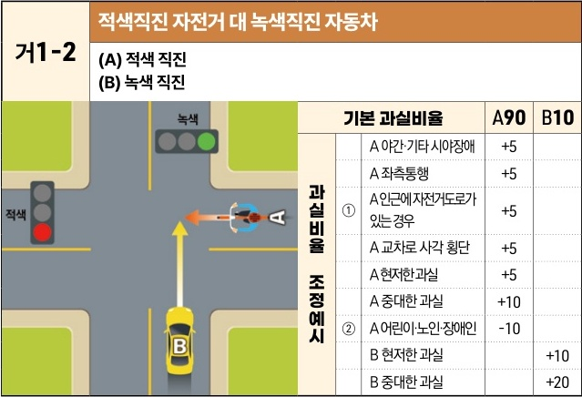

자동차사고 과실비율 인정기준 | 제3편 사고유형별 과실비율 적용기준 014

| 거1-2                                    | 적색직진 자전거 대 녹색직진 자동차 |
| --------------------------------------- | ------------------- |
| \*\*(A) 적색 직진\*\* \*\*(B) 녹색 직진\*\* |                     |

[The image shows a diagram of a four-way intersection. Vehicle B (a yellow car) is entering the intersection on a green light. Bicycle A is entering the intersection from the right on a red light, moving straight across the path of Vehicle B. A collision point is indicated in the center of the intersection.]

| 기본 과실비율   | 기본 과실비율 | 기본 과실비율            | A90 | B10 |
| --------- | ------- | ------------------ | --- | --- |
| 과실비율 조정예시 | ①       | A 야간·기타 시야장애       | +5  |     |
|           |         | A 좌측통행             | +5  |     |
|           |         | A 인근에 자전거도로가 있는 경우 | +5  |     |
|           |         | A 교차로 사각 횡단        | +5  |     |
|           |         | A 현저한 과실           | +5  |     |
|           |         | A 중대한 과실           | +10 |     |
|           | ②       | A 어린이·노인·장애인       | -10 |     |
|           |         | B 현저한 과실           |     | +10 |
|           |         | B 중대한 과실           |     | +20 |

※사고발생, 손해확대와의 인과관계를 감안하여 기본 과실비율을 가(+), 감(-) 조정 가능합니다.
※舊 402 기준

### 사고 상황
* <mark>거1-2</mark> 신호기에 의해 교통정리가 이루어지고 있는 교차로에서 서로 다른 도로를 이용하여 녹색신호에 교차로에 진입하여 직진하는 B차량과 적색신호에 교차로에 진입하여 직진하는 A자전거가 충돌한 사고이다.

### 기본 과실비율 해설
* <mark>거1-1</mark> 도로교통법 제5조에 따라 모든 차량에게 신호기의 신호에 따를 의무가 있으므로, 정상적인 신호에 교차로에 진입한 A자전거는 신호를 무시하고 교차로에 진입하는 B차량에 대한 예견 및 회피 가능성이 극히 적으므로 신호위반을 한 B차량의 일방과실로 정한다.
* <mark>거1-2</mark> A자전거가 적색신호에 진입하여 신호위반을 하였으므로 A자전거의 과실이 매우 중하다고 할 것이지만, 자전거는 통상 저속으로 운행하므로 B차량으로서는 이를 발견하여 사고의 발생을 회피할 수 있다는 점 및 자전거는 차량에 비하여 상대방에게 가해의 위험성이 현저히 낮다는 점을 감안하여 A자전거의 과실을 약간 낮추어 양측의 기본 과실비율을 90:10으로 정하였다.

제3장. 자동차와 자전거(농기계 포함)의 사고
