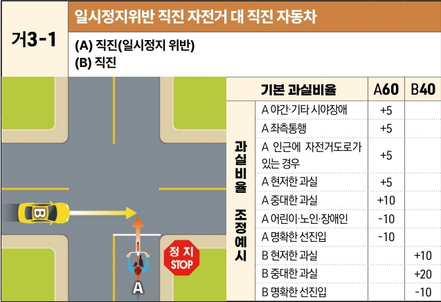
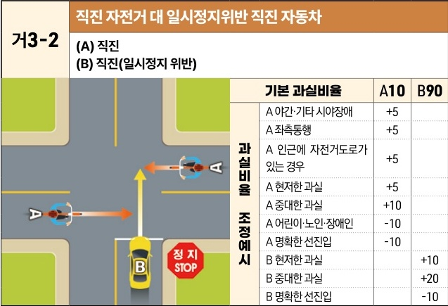

자동차사고 과실비율 인정기준 | 제3편 사고유형별 과실비율 적용기준 025

## (2) 한쪽 지시표지 있는 교차로

### 1) 직진 대 직진 사고 [거3]

| 거3-1                                       | 일시정지위반 직진 자전거 대 직진 자동차 |
| ------------------------------------------ | ---------------------- |
| \*\*(A) 직진(일시정지 위반)\*\* \*\*(B) 직진\*\* |                        |

| 과실비율 조정예시 | 기본 과실비율            | 기본 과실비율 | A60 | B40 |
| --------- | ------------------ | ------- | --- | --- |
| 과실비율 조정예시 | A 야간·기타 시야장애       | +5      |     |     |
|           | A 좌측통행             | +5      |     |     |
|           | A 인근에 자전거도로가 있는 경우 | +5      |     |     |
|           | A 현저한 과실           | +5      |     |     |
|           | A 중대한 과실           | +10     |     |     |
|           | A 어린이·노인·장애인       | -10     |     |     |
|           | A 명확한 선진입          | -10     |     |     |
|           | B 현저한 과실           |         | +10 |     |
|           | B 중대한 과실           |         | +20 |     |
|           | B 명확한 선진입          |         | -10 |     |

※사고발생, 손해확대와의 인과관계를 감안하여 기본 과실비율을 가(+), 감(-) 조정 가능합니다. / ※舊 410 기준

| 거3-2                                       | 직진 자전거 대 일시정지위반 직진 자동차 |
| ------------------------------------------ | ---------------------- |
| \*\*(A) 직진\*\* \*\*(B) 직진(일시정지 위반)\*\* |                        |

| 과실비율 조정예시 | 기본 과실비율            | 기본 과실비율 | A10 | B90 |
| --------- | ------------------ | ------- | --- | --- |
| 과실비율 조정예시 | A 야간·기타 시야장애       | +5      |     |     |
|           | A 좌측통행             | +5      |     |     |
|           | A 인근에 자전거도로가 있는 경우 | +5      |     |     |
|           | A 현저한 과실           | +5      |     |     |
|           | A 중대한 과실           | +10     |     |     |
|           | A 어린이·노인·장애인       | -10     |     |     |
|           | A 명확한 선진입          | -10     |     |     |
|           | B 현저한 과실           |         | +10 |     |
|           | B 중대한 과실           |         | +20 |     |
|           | B 명확한 선진입          |         | -10 |     |

※사고발생, 손해확대와의 인과관계를 감안하여 기본 과실비율을 가(+), 감(-) 조정 가능합니다. / ※舊 411 기준

제3장. 자동차와 자전거(농기계 포함)의 사고
