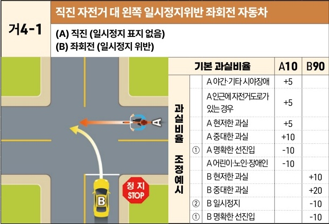
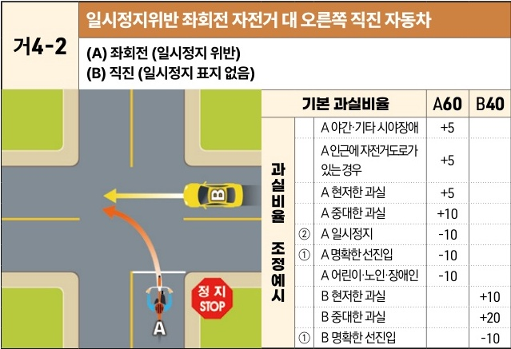

자동차사고 과실비율 인정기준 | 제3편 사고유형별 과실비율 적용기준 031

## 2) 직진 대 좌회전 사고 [거4]

### 거4-1 직진 자전거 대 왼쪽 일시정지위반 좌회전 자동차
**(A) 직진 (일시정지 표지 없음)**
**(B) 좌회전 (일시정지 위반)**

[The image shows a diagram of a T-junction intersection. Bicycle A is traveling straight from right to left. Car B is turning left from the bottom road, which has a "STOP" (정지) sign.]

|           | 과실비율 조정예시          | 과실비율 조정예시 | 기본 과실비율 | A10 | B90 |
| --------- | ------------------ | --------- | ------- | --- | --- |
| 과실비율 조정예시 | A 야간·기타 시야장애       | +5        |         |     |     |
|           | A 인근에 자전거도로가 있는 경우 | +5        |         |     |     |
|           | A 현저한 과실           | +5        |         |     |     |
|           | A 중대한 과실           | +10       |         |     |     |
|           | ① A 명확한 선진입        | -10       |         |     |     |
|           | A 어린이·노인·장애인       | -10       |         |     |     |
|           | B 현저한 과실           |           | +10     |     |     |
|           | B 중대한 과실           |           | +20     |     |     |
|           | ② B 일시정지           |           | -10     |     |     |
|           | ① B 명확한 선진입        |           | -10     |     |     |

※사고발생, 손해확대와의 인과관계를 감안하여 기본 과실비율을 가(+), 감(-) 조정 가능합니다.
※舊 428 기준

----

### 거4-2 일시정지위반 좌회전 자전거 대 오른쪽 직진 자동차
**(A) 좌회전 (일시정지 위반)**
**(B) 직진 (일시정지 표지 없음)**

[The image shows a diagram of a T-junction intersection. Bicycle A is turning left from the bottom road, which has a "STOP" (정지) sign. Car B is traveling straight from right to left.]

|           | 과실비율 조정예시          | 과실비율 조정예시 | 기본 과실비율 | A60 | B40 |
| --------- | ------------------ | --------- | ------- | --- | --- |
| 과실비율 조정예시 | A 야간·기타 시야장애       | +5        |         |     |     |
|           | A 인근에 자전거도로가 있는 경우 | +5        |         |     |     |
|           | A 현저한 과실           | +5        |         |     |     |
|           | A 중대한 과실           | +10       |         |     |     |
|           | ② A 일시정지           | -10       |         |     |     |
|           | ① A 명확한 선진입        | -10       |         |     |     |
|           | A 어린이·노인·장애인       | -10       |         |     |     |
|           | B 현저한 과실           |           | +10     |     |     |
|           | B 중대한 과실           |           | +20     |     |     |
|           | ① B 명확한 선진입        |           | -10     |     |     |

※사고발생, 손해확대와의 인과관계를 감안하여 기본 과실비율을 가(+), 감(-) 조정 가능합니다.
※舊 429 기준

제3장. 자동차와 자전거(농기계 포함)의 사고
