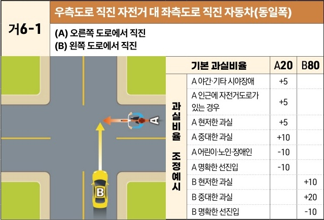
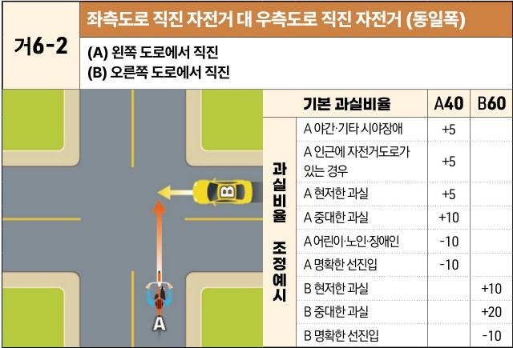

자동차사고 과실비율 인정기준 | 제3편 사고유형별 과실비율 적용기준 043 목차

# (3) 신호등 없는 교차로

## 1) 직진 대 직진 사고 [거6]

### 거6-1 우측도로 직진 자전거 대 좌측도로 직진 자동차(동일폭)
**(A) 오른쪽 도로에서 직진**
**(B) 왼쪽 도로에서 직진**

[The image shows a diagram of a four-way intersection. Bicycle (A) is entering from the right road and proceeding straight (leftwards). Car (B) is entering from the bottom road and proceeding straight (upwards). They are on a collision course in the center of the intersection.]

| 과실비율 조정예시 | 기본 과실비율            | 기본 과실비율 | A20 | B80 |
| --------- | ------------------ | ------- | --- | --- |
| 과실비율 조정예시 | A 야간·기타 시야장애       | +5      |     |     |
|           | A 인근에 자전거도로가 있는 경우 | +5      |     |     |
|           | A 현저한 과실           | +5      |     |     |
|           | A 중대한 과실           | +10     |     |     |
|           | A 어린이·노인·장애인       | -10     |     |     |
|           | A 명확한 선진입          | -10     |     |     |
|           | B 현저한 과실           |         | +10 |     |
|           | B 중대한 과실           |         | +20 |     |
|           | B 명확한 선진입          |         | -10 |     |

※사고발생, 손해확대와의 인과관계를 감안하여 기본 과실비율을 가(+), 감(-) 조정 가능합니다. / ※舊 406 기준

----

### 거6-2 좌측도로 직진 자전거 대 우측도로 직진 자전거 (동일폭)
**(A) 왼쪽 도로에서 직진**
**(B) 오른쪽 도로에서 직진**

[The image shows a diagram of a four-way intersection. Bicycle (A) is entering from the bottom road and proceeding straight (upwards). Bicycle (B) is entering from the right road and proceeding straight (leftwards). They are on a collision course in the center of the intersection.]

| 과실비율 조정예시 | 기본 과실비율            | 기본 과실비율 | A40 | B60 |
| --------- | ------------------ | ------- | --- | --- |
| 과실비율 조정예시 | A 야간·기타 시야장애       | +5      |     |     |
|           | A 인근에 자전거도로가 있는 경우 | +5      |     |     |
|           | A 현저한 과실           | +5      |     |     |
|           | A 중대한 과실           | +10     |     |     |
|           | A 어린이·노인·장애인       | -10     |     |     |
|           | A 명확한 선진입          | -10     |     |     |
|           | B 현저한 과실           |         | +10 |     |
|           | B 중대한 과실           |         | +20 |     |
|           | B 명확한 선진입          |         | -10 |     |

※사고발생, 손해확대와의 인과관계를 감안하여 기본 과실비율을 가(+), 감(-) 조정 가능합니다. / ※舊 407 기준

제3장. 자동차와 자전거(농기계 포함)의 사고
