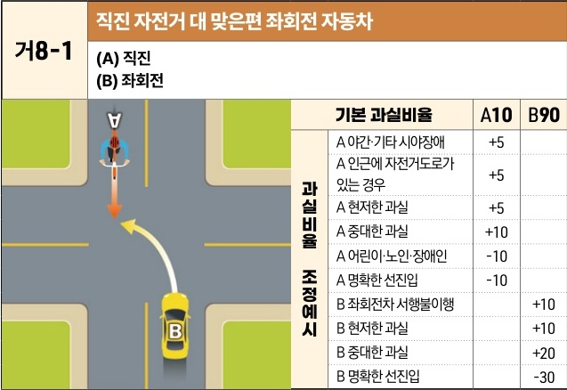
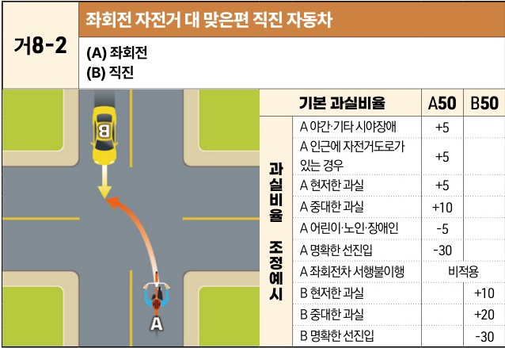

자동차사고 과실비율 인정기준 | 제3편 사고유형별 과실비율 적용기준 056 목차

### 3) 직진 대 좌회전 사고 - 상대측이 맞은편에서 진입 [거8]

#### 거8-1 직진 자전거 대 맞은편 좌회전 자동차
(A) 직진
(B) 좌회전

[The image shows a diagram of a T-junction or intersection where a bicycle (A) is proceeding straight from the top, and a car (B) is turning left from the opposite direction, leading to a collision.]

| 과실비율 조정예시 | 기본 과실비율            | 기본 과실비율 | A10 | B90 |
| --------- | ------------------ | ------- | --- | --- |
| 과실비율 조정예시 | A 야간·기타 시야장애       | +5      |     |     |
|           | A 인근에 자전거도로가 있는 경우 | +5      |     |     |
|           | A 현저한 과실           | +5      |     |     |
|           | A 중대한 과실           | +10     |     |     |
|           | A 어린이·노인·장애인       | -10     |     |     |
|           | A 명확한 선진입          | -10     |     |     |
|           | B 좌회전차 서행불이행       |         | +10 |     |
|           | B 현저한 과실           |         | +10 |     |
|           | B 중대한 과실           |         | +20 |     |
|           | B 명확한 선진입          |         | -30 |     |

※사고발생, 손해확대와의 인과관계를 감안하여 기본 과실비율을 가(+), 감(-) 조정 가능합니다.
※舊 416 기준

#### 거8-2 좌회전 자전거 대 맞은편 직진 자동차
(A) 좌회전
(B) 직진

[The image shows a diagram of a T-junction or intersection where a bicycle (A) is turning left from the bottom, and a car (B) is proceeding straight from the opposite direction, leading to a collision.]

| 과실비율 조정예시 | 기본 과실비율            | 기본 과실비율 | A50 | B50 |
| --------- | ------------------ | ------- | --- | --- |
| 과실비율 조정예시 | A 야간·기타 시야장애       | +5      |     |     |
|           | A 인근에 자전거도로가 있는 경우 | +5      |     |     |
|           | A 현저한 과실           | +5      |     |     |
|           | A 중대한 과실           | +10     |     |     |
|           | A 어린이·노인·장애인       | -5      |     |     |
|           | A 명확한 선진입          | -30     |     |     |
|           | A 좌회전차 서행불이행       | 비적용     |     |     |
|           | B 현저한 과실           |         | +10 |     |
|           | B 중대한 과실           |         | +20 |     |
|           | B 명확한 선진입          |         | -30 |     |

※사고발생, 손해확대와의 인과관계를 감안하여 기본 과실비율을 가(+), 감(-) 조정 가능합니다.
※舊 417 기준

제1장. 자동차와 보행자의 사고
제2장. 자동차와 자동차(이륜차 포함)의 사고
제3장. 자동차와 자전거(농기계 포함)의 사고
