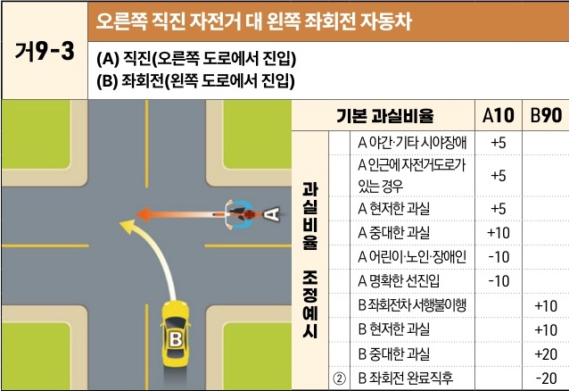
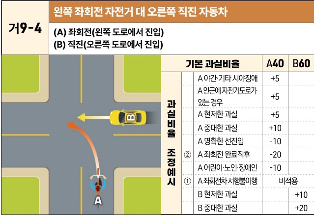

자동차사고 과실비율 인정기준 | 제3편 사고유형별 과실비율 적용기준 062

| 거9-3                                                        | 오른쪽 직진 자전거 대 왼쪽 좌회전 자동차 |
| ----------------------------------------------------------- | ----------------------- |
| \*\*(A) 직진(오른쪽 도로에서 진입)\*\* \*\*(B) 좌회전(왼쪽 도로에서 진입)\*\* |                         |

The image shows a T-junction intersection. Bicycle (A) is traveling straight from the right road into the intersection. Car (B) is entering from the bottom road and making a left turn into the road where the bicycle originated.

| 과실비율 조정예시 | 기본 과실비율            | 기본 과실비율    | A10 | B90 |
| --------- | ------------------ | ---------- | --- | --- |
| 과실비율 조정예시 | A 야간·기타 시야장애       | +5         |     |     |
|           | A 인근에 자전거도로가 있는 경우 | +5         |     |     |
|           | A 현저한 과실           | +5         |     |     |
|           | A 중대한 과실           | +10        |     |     |
|           | A 어린이·노인·장애인       | -10        |     |     |
|           | A 명확한 선진입          | -10        |     |     |
|           | B 좌회전차 서행불이행       |            | +10 |     |
|           | B 현저한 과실           |            | +10 |     |
|           | B 중대한 과실           |            | +20 |     |
|           | ②                  | B 좌회전 완료직후 |     | -20 |

※사고발생, 손해확대와의 인과관계를 감안하여 기본 과실비율을 가(+), 감(-) 조정 가능합니다.
※舊 420 기준

| 거9-4                                                        | 왼쪽 좌회전 자전거 대 오른쪽 직진 자동차 |
| ----------------------------------------------------------- | ----------------------- |
| \*\*(A) 좌회전(왼쪽 도로에서 진입)\*\* \*\*(B) 직진(오른쪽 도로에서 진입)\*\* |                         |

The image shows a T-junction intersection. Bicycle (A) is entering from the bottom road and making a left turn. Car (B) is traveling straight from the right road into the intersection.

| 과실비율 조정예시 | 기본 과실비율            | 기본 과실비율      | A40 | B60 |
| --------- | ------------------ | ------------ | --- | --- |
| 과실비율 조정예시 | A 야간·기타 시야장애       | +5           |     |     |
|           | A 인근에 자전거도로가 있는 경우 | +5           |     |     |
|           | A 현저한 과실           | +5           |     |     |
|           | A 중대한 과실           | +10          |     |     |
|           | A 명확한 선진입          | -10          |     |     |
|           | ②                  | A 좌회전 완료직후   | -20 |     |
|           | A 어린이·노인·장애인       | -10          |     |     |
|           | ①                  | A 좌회전차 서행불이행 | 비적용 |     |
|           | B 현저한 과실           |              | +10 |     |
|           | B 중대한 과실           |              | +20 |     |

※사고발생, 손해확대와의 인과관계를 감안하여 기본 과실비율을 가(+), 감(-) 조정 가능합니다.
※舊 421 기준

제3장. 자동차와 자전거(농기계 포함)의 사고
