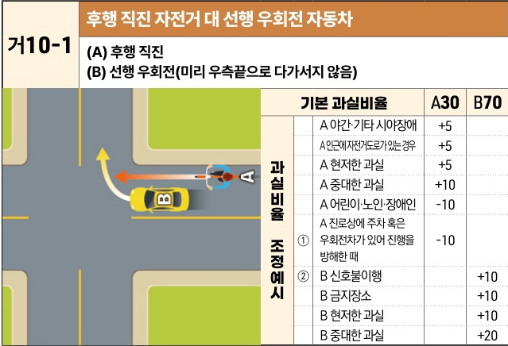
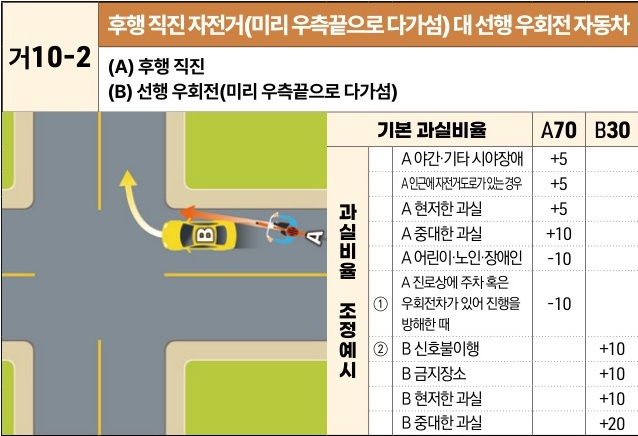

자동차사고 과실비율 인정기준 | 제3편 사고유형별 과실비율 적용기준 072 목차

## (4) 동일차로 통행 중 사고

### 1) 교차로 부근 선행 우회전 대 후행 직진 사고 [거10]

#### 거10-1 후행 직진 자전거 대 선행 우회전 자동차
**(A) 후행 직진**
**(B) 선행 우회전(미리 우측끝으로 다가서지 않음)**

The image shows a diagram of a T-junction where a bicycle (A) is traveling straight ahead on the right side of the road, and a car (B) ahead of it is attempting a right turn without having moved to the far right edge of the lane.

| 과실비율 조정예시 | 기본 과실비율                           | 기본 과실비율 | A30 | B70 |
| --------- | --------------------------------- | ------- | --- | --- |
| 과실비율 조정예시 | A 야간·기타 시야장애                      | +5      |     |     |
|           | A 인근에 자전거도로가 있는 경우                | +5      |     |     |
|           | A 현저한 과실                          | +5      |     |     |
|           | A 중대한 과실                          | +10     |     |     |
|           | A 어린이·노인·장애인                      | -10     |     |     |
|           | ① A 진로상에 주차 혹은 우회전차가 있어 진행을 방해한 때 | -10     |     |     |
| 과실비율 조정예시 | ② B 신호불이행                         |         | +10 |     |
|           | B 금지장소                            |         | +10 |     |
|           | B 현저한 과실                          |         | +10 |     |
|           | B 중대한 과실                          |         | +20 |     |

※사고발생, 손해확대와의 인과관계를 감안하여 기본 과실비율을 가(+), 감(-) 조정 가능합니다. / ※舊 440 기준

----

#### 거10-2 후행 직진 자전거(미리 우측끝으로 다가섬) 대 선행 우회전 자동차
**(A) 후행 직진**
**(B) 선행 우회전(미리 우측끝으로 다가섬)**

The image shows a diagram of a T-junction where a car (B) has already moved to the far right edge of the lane to make a right turn, and a bicycle (A) is attempting to pass straight through on the right side of the car.

| 과실비율 조정예시 | 기본 과실비율                           | 기본 과실비율 | A70 | B30 |
| --------- | --------------------------------- | ------- | --- | --- |
| 과실비율 조정예시 | A 야간·기타 시야장애                      | +5      |     |     |
|           | A 인근에 자전거도로가 있는 경우                | +5      |     |     |
|           | A 현저한 과실                          | +5      |     |     |
|           | A 중대한 과실                          | +10     |     |     |
|           | A 어린이·노인·장애인                      | -10     |     |     |
|           | ① A 진로상에 주차 혹은 우회전차가 있어 진행을 방해한 때 | -10     |     |     |
| 과실비율 조정예시 | ② B 신호불이행                         |         | +10 |     |
|           | B 금지장소                            |         | +10 |     |
|           | B 현저한 과실                          |         | +10 |     |
|           | B 중대한 과실                          |         | +20 |     |

※사고발생, 손해확대와의 인과관계를 감안하여 기본 과실비율을 가(+), 감(-) 조정 가능합니다. / ※舊 441 기준

제1장. 자동차와 보행자의 사고
제2장. 자동차와 자동차(이륜차 포함)의 사고
제3장. 자동차와 자전거(농기계 포함)의 사고
