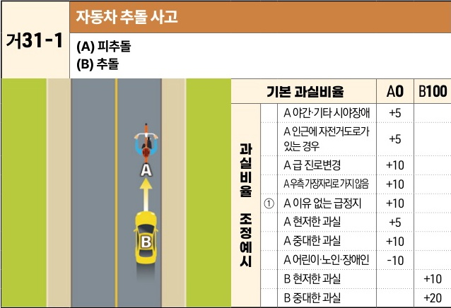
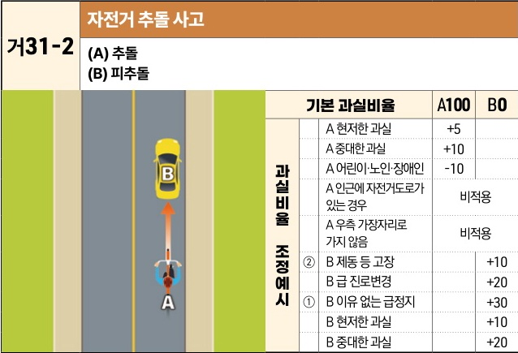

자동차사고 과실비율 인정기준 | 제3편 사고유형별 과실비율 적용기준 081 목차

## 다. 같은 방향 진행차량 상호 간의 사고
### (1) 안전거리미확보로 인한 추돌사고 [거31]

#### 거31-1 자동차 추돌 사고
(A) 피추돌
(B) 추돌

[The image shows a diagram of a car (B) rear-ending a bicycle (A) on a road.]

| 과실비율 조정예시 | 기본 과실비율   | 기본 과실비율            | A0  | B100 |
| --------- | --------- | ------------------ | --- | ---- |
| ①         | 과실비율 조정예시 | A 야간·기타 시야장애       | +5  |      |
|           |           | A 인근에 자전거도로가 있는 경우 | +5  |      |
|           |           | A 급 진로변경           | +10 |      |
|           |           | A 우측 가장자리로 가지 않음   | +10 |      |
|           |           | A 이유 없는 급정지        | +10 |      |
|           |           | A 현저한 과실           | +5  |      |
|           |           | A 중대한 과실           | +10 |      |
|           |           | A 어린이·노인·장애인       | -10 |      |
|           | B 현저한 과실  |                    | +10 |      |
|           | B 중대한 과실  |                    | +20 |      |

※사고발생, 손해확대와의 인과관계를 감안하여 기본 과실비율을 가(+), 감(-) 조정 가능합니다. / ※舊 450 기준

#### 거31-2 자전거 추돌 사고
(A) 추돌
(B) 피추돌

[The image shows a diagram of a bicycle (A) rear-ending a car (B) on a road.]

| 과실비율 조정예시 | 기본 과실비율   | 기본 과실비율            | A100 | B0  |
| --------- | --------- | ------------------ | ---- | --- |
| ②         | 과실비율 조정예시 | A 현저한 과실           | +5   |     |
|           |           | A 중대한 과실           | +10  |     |
|           |           | A 어린이·노인·장애인       | -10  |     |
|           |           | A 인근에 자전거도로가 있는 경우 | 비적용  |     |
|           |           | A 우측 가장자리로 가지 않음   | 비적용  |     |
|           |           | B 제동 등 고장          |      | +10 |
|           |           | B 급 진로변경           |      | +20 |
| ①         |           | B 이유 없는 급정지        |      | +30 |
|           |           | B 현저한 과실           |      | +10 |
|           |           | B 중대한 과실           |      | +20 |

※사고발생, 손해확대와의 인과관계를 감안하여 기본 과실비율을 가(+), 감(-) 조정 가능합니다. / ※舊 451 기준

제3장. 자동차와 자전거(농기계 포함)의 사고
