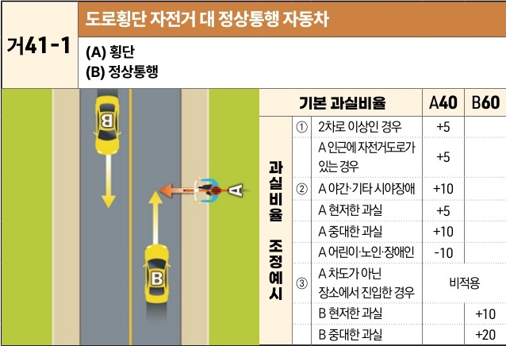

자동차사고 과실비율 인정기준 | 제3편 사고유형별 과실비율 적용기준 091 목차

# 라. 기타 유형의 사고
## (1) 자전거 도로횡단 사고 [거41]

| 거41-1                                                                                                                                                                                                                                               | 도로횡단 자전거 대 정상통행 자동차 (A) 횡단(B) 정상통행 | 도로횡단 자전거 대 정상통행 자동차 (A) 횡단(B) 정상통행 | 도로횡단 자전거 대 정상통행 자동차 (A) 횡단(B) 정상통행 | 도로횡단 자전거 대 정상통행 자동차 (A) 횡단(B) 정상통행 | 도로횡단 자전거 대 정상통행 자동차 (A) 횡단(B) 정상통행 |
| --------------------------------------------------------------------------------------------------------------------------------------------------------------------------------------------------------------------------------------------------- | -------------------------------------- | -------------------------------------- | -------------------------------------- | -------------------------------------- | -------------------------------------- |
| \[The image shows a diagram of a two-lane road. Vehicle B is traveling straight in the right lane. Bicycle A is crossing the road from the right side, perpendicular to the direction of Vehicle B. There is another vehicle in the opposite lane.] | 기본 과실비율                                |                                        | A40                                    | B60                                    |                                        |
|                                                                                                                                                                                                                                                     | 과실비율 조정예시                              | ①                                      | 2차로 이상인 경우                             | +5                                     |                                        |
|                                                                                                                                                                                                                                                     |                                        | ②                                      | A 인근에 자전거도로가 있는 경우                     | +5                                     |                                        |
|                                                                                                                                                                                                                                                     |                                        |                                        | A 야간·기타 시야장애                           | +10                                    |                                        |
|                                                                                                                                                                                                                                                     |                                        |                                        | A 현저한 과실                               | +5                                     |                                        |
|                                                                                                                                                                                                                                                     |                                        |                                        | A 중대한 과실                               | +10                                    |                                        |
|                                                                                                                                                                                                                                                     |                                        |                                        | A 어린이·노인·장애인                           | -10                                    |                                        |
|                                                                                                                                                                                                                                                     |                                        | ③                                      | A 차도가 아닌 장소에서 진입한 경우                   | 비적용                                    |                                        |
|                                                                                                                                                                                                                                                     |                                        | B 현저한 과실                               |                                        | +10                                    |                                        |
|                                                                                                                                                                                                                                                     |                                        | B 중대한 과실                               |                                        | +20                                    |                                        |

※사고발생, 손해확대와의 인과관계를 감안하여 기본 과실비율을 가(+), 감(-) 조정 가능합니다.
※舊 444 기준

### 사고 상황
* 도로에서 정상 진행 중인 B차량과 도로를 횡단하는 A자전거가 충돌한 사고이다.

### 기본 과실비율 해설
* 자전거 운전자가 도로를 횡단하고자 할 경우에는 자전거에서 내려서 횡단보도를 이용하거나 (이 경우 보행자로 취급됨) 탑승한 채로 자전거횡단도를 이용하여야 한다. 따라서 자전거의 도로 횡단행위는 도로교통법 제18조 제1항에 반하는 행위이지만, 자전거는 저속이라는 점 및 자동차가 자전거를 발견하고 회피할 수 있었다는 점 등을 감안하여 양측의 기본과실을 40:60으로 정하였다.

### 수정요소(인과관계를 감안한 과실비율 조정) 해설
① 도로가 2차로 이상인 경우 자전거의 무단횡단으로 인한 사고의 위험이 가중되므로 A자전

제1장. 자동차와 보행자의 사고
제2장. 자동차와 자동차(이륜차 포함)의 사고
제3장. 자동차와 자전거(농기계 포함)의 사고
