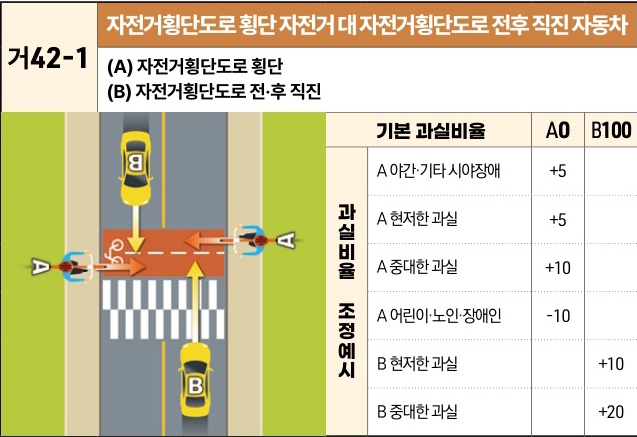

자동차사고 과실비율 인정기준 | 제3편 사고유형별 과실비율 적용기준 093 **목차**

## (2) 자전거횡단도로 횡단사고 [거42]

| 거42-1                                                                                                                                          | 자전거횡단도로 횡단 자전거 대 자전거횡단도로 전후 직진 자동차 (A) 자전거횡단도로 횡단(B) 자전거횡단도로 전·후 직진 | 자전거횡단도로 횡단 자전거 대 자전거횡단도로 전후 직진 자동차 (A) 자전거횡단도로 횡단(B) 자전거횡단도로 전·후 직진 | 자전거횡단도로 횡단 자전거 대 자전거횡단도로 전후 직진 자동차 (A) 자전거횡단도로 횡단(B) 자전거횡단도로 전·후 직진 | 자전거횡단도로 횡단 자전거 대 자전거횡단도로 전후 직진 자동차 (A) 자전거횡단도로 횡단(B) 자전거횡단도로 전·후 직진 |
| ---------------------------------------------------------------------------------------------------------------------------------------------- | ----------------------------------------------------------------------- | ----------------------------------------------------------------------- | ----------------------------------------------------------------------- | ----------------------------------------------------------------------- |
| \[The image shows a diagram of a bicycle (A) crossing a bicycle crossing path and a car (B) driving straight through it on a multi-lane road.] | 기본 과실비율 \[thead] A0 \[thead] B100                                       |                                                                         |                                                                         |                                                                         |
|                                                                                                                                                | 과실비율 조정예시 A 야간·기타 시야장애 +5                                               |                                                                         |                                                                         |                                                                         |
|                                                                                                                                                |                                                                         | A 현저한 과실 +5                                                             |                                                                         |                                                                         |
|                                                                                                                                                |                                                                         | A 중대한 과실 +10                                                            |                                                                         |                                                                         |
|                                                                                                                                                |                                                                         | A 어린이·노인·장애인 -10                                                        |                                                                         |                                                                         |
|                                                                                                                                                |                                                                         | B 현저한 과실 +10                                                            |                                                                         |                                                                         |
|                                                                                                                                                |                                                                         | B 중대한 과실 +20                                                            |                                                                         |                                                                         |

※사고발생, 손해확대와의 인과관계를 감안하여 기본 과실비율을 가(+), 감(-) 조정 가능합니다.
※舊 452 기준

### 사고 상황
* 자전거횡단도를 횡단하는 A자전거와 직진하여 자전거횡단도를 통과하는 B차량이 충돌한 사고이다.

### 기본 과실비율 해설
* 자전거는 도로교통법 제15조의 2 및 동법 시행규칙 [별표2]에 따라 자전거 횡단도에 자전거 통행신호등이 설치된 경우에는 그 신호, 자전거 통행신호등이 없는 경우에는 보행신호 등에 따라 횡단하여야 하는바, A자전거가 자전거횡단도를 이용하여 횡단하다가 직진 중인 B차량과 충돌한 것이므로 B차량의 일방과실로 정하였다.

제3장. 자동차와 자전거(농기계 포함)의 사고
