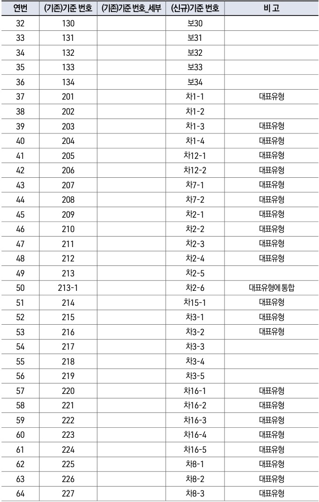

자동차사고 과실비율 인정기준 | (별첨) 변경대비표 101

| 연번 | (기존)기준 번호 | (기존)기준 번호\_세부 | (신규)기준 번호 | 비 고      |
| -- | --------- | ------------- | --------- | -------- |
| 32 | 130       |               | 보30       |          |
| 33 | 131       |               | 보31       |          |
| 34 | 132       |               | 보32       |          |
| 35 | 133       |               | 보33       |          |
| 36 | 134       |               | 보34       |          |
| 37 | 201       |               | 차1-1      | 대표유형     |
| 38 | 202       |               | 차1-2      |          |
| 39 | 203       |               | 차1-3      | 대표유형     |
| 40 | 204       |               | 차1-4      | 대표유형     |
| 41 | 205       |               | 차12-1     | 대표유형     |
| 42 | 206       |               | 차12-2     | 대표유형     |
| 43 | 207       |               | 차7-1      | 대표유형     |
| 44 | 208       |               | 차7-2      | 대표유형     |
| 45 | 209       |               | 차2-1      | 대표유형     |
| 46 | 210       |               | 차2-2      | 대표유형     |
| 47 | 211       |               | 차2-3      | 대표유형     |
| 48 | 212       |               | 차2-4      | 대표유형     |
| 49 | 213       |               | 차2-5      |          |
| 50 | 213-1     |               | 차2-6      | 대표유형에 통합 |
| 51 | 214       |               | 차15-1     | 대표유형     |
| 52 | 215       |               | 차3-1      | 대표유형     |
| 53 | 216       |               | 차3-2      | 대표유형     |
| 54 | 217       |               | 차3-3      |          |
| 55 | 218       |               | 차3-4      |          |
| 56 | 219       |               | 차3-5      |          |
| 57 | 220       |               | 차16-1     | 대표유형     |
| 58 | 221       |               | 차16-2     | 대표유형     |
| 59 | 222       |               | 차16-3     | 대표유형     |
| 60 | 223       |               | 차16-4     | 대표유형     |
| 61 | 224       |               | 차16-5     | 대표유형     |
| 62 | 225       |               | 차8-1      | 대표유형     |
| 63 | 226       |               | 차8-2      | 대표유형     |
| 64 | 227       |               | 차8-3      | 대표유형     |

