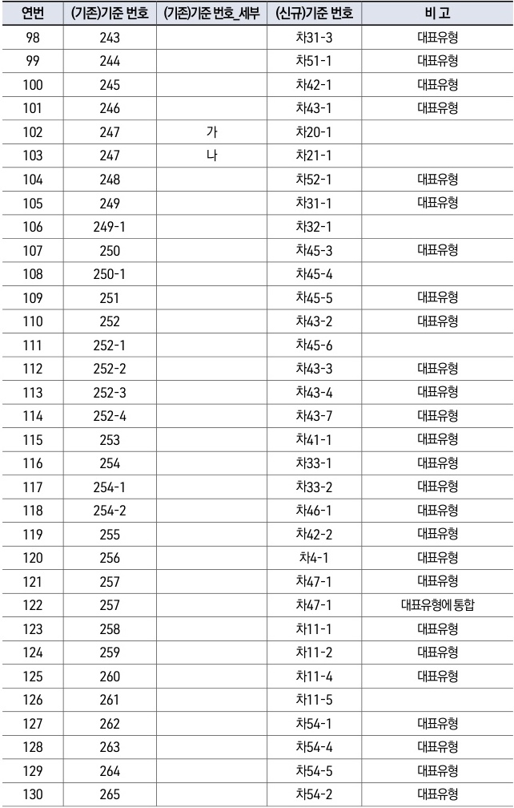

자동차사고 과실비율 인정기준 | (별첨) 변경대비표 103

| 연번  | (기존)기준 번호 | (기존)기준 번호\_세부 | (신규)기준 번호 | 비 고      |
| --- | --------- | ------------- | --------- | -------- |
| 98  | 243       |               | 차31-3     | 대표유형     |
| 99  | 244       |               | 차51-1     | 대표유형     |
| 100 | 245       |               | 차42-1     | 대표유형     |
| 101 | 246       |               | 차43-1     | 대표유형     |
| 102 | 247       | 가             | 차20-1     |          |
| 103 | 247       | 나             | 차21-1     |          |
| 104 | 248       |               | 차52-1     | 대표유형     |
| 105 | 249       |               | 차31-1     | 대표유형     |
| 106 | 249-1     |               | 차32-1     |          |
| 107 | 250       |               | 차45-3     | 대표유형     |
| 108 | 250-1     |               | 차45-4     |          |
| 109 | 251       |               | 차45-5     | 대표유형     |
| 110 | 252       |               | 차43-2     | 대표유형     |
| 111 | 252-1     |               | 차45-6     |          |
| 112 | 252-2     |               | 차43-3     | 대표유형     |
| 113 | 252-3     |               | 차43-4     | 대표유형     |
| 114 | 252-4     |               | 차43-7     | 대표유형     |
| 115 | 253       |               | 차41-1     | 대표유형     |
| 116 | 254       |               | 차33-1     | 대표유형     |
| 117 | 254-1     |               | 차33-2     | 대표유형     |
| 118 | 254-2     |               | 차46-1     | 대표유형     |
| 119 | 255       |               | 차42-2     | 대표유형     |
| 120 | 256       |               | 차4-1      | 대표유형     |
| 121 | 257       |               | 차47-1     | 대표유형     |
| 122 | 257       |               | 차47-1     | 대표유형에 통합 |
| 123 | 258       |               | 차11-1     | 대표유형     |
| 124 | 259       |               | 차11-2     | 대표유형     |
| 125 | 260       |               | 차11-4     | 대표유형     |
| 126 | 261       |               | 차11-5     |          |
| 127 | 262       |               | 차54-1     | 대표유형     |
| 128 | 263       |               | 차54-4     | 대표유형     |
| 129 | 264       |               | 차54-5     | 대표유형     |
| 130 | 265       |               | 차54-2     | 대표유형     |

