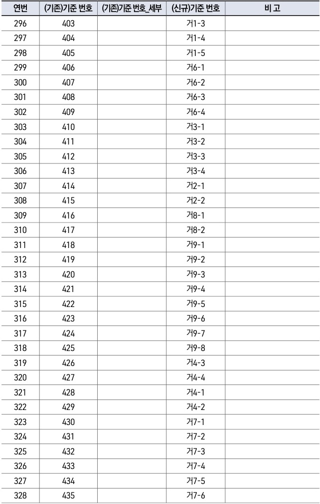

자동차사고 과실비율 인정기준 | (별첨) 변경대비표 109

| 연번  | (기존)기준 번호 | (기존)기준 번호\_세부 | (신규)기준 번호 | 비 고 |
| --- | --------- | ------------- | --------- | --- |
| 296 | 403       |               | 거1-3      |     |
| 297 | 404       |               | 거1-4      |     |
| 298 | 405       |               | 거1-5      |     |
| 299 | 406       |               | 거6-1      |     |
| 300 | 407       |               | 거6-2      |     |
| 301 | 408       |               | 거6-3      |     |
| 302 | 409       |               | 거6-4      |     |
| 303 | 410       |               | 거3-1      |     |
| 304 | 411       |               | 거3-2      |     |
| 305 | 412       |               | 거3-3      |     |
| 306 | 413       |               | 거3-4      |     |
| 307 | 414       |               | 거2-1      |     |
| 308 | 415       |               | 거2-2      |     |
| 309 | 416       |               | 거8-1      |     |
| 310 | 417       |               | 거8-2      |     |
| 311 | 418       |               | 거9-1      |     |
| 312 | 419       |               | 거9-2      |     |
| 313 | 420       |               | 거9-3      |     |
| 314 | 421       |               | 거9-4      |     |
| 315 | 422       |               | 거9-5      |     |
| 316 | 423       |               | 거9-6      |     |
| 317 | 424       |               | 거9-7      |     |
| 318 | 425       |               | 거9-8      |     |
| 319 | 426       |               | 거4-3      |     |
| 320 | 427       |               | 거4-4      |     |
| 321 | 428       |               | 거4-1      |     |
| 322 | 429       |               | 거4-2      |     |
| 323 | 430       |               | 거7-1      |     |
| 324 | 431       |               | 거7-2      |     |
| 325 | 432       |               | 거7-3      |     |
| 326 | 433       |               | 거7-4      |     |
| 327 | 434       |               | 거7-5      |     |
| 328 | 435       |               | 거7-6      |     |

