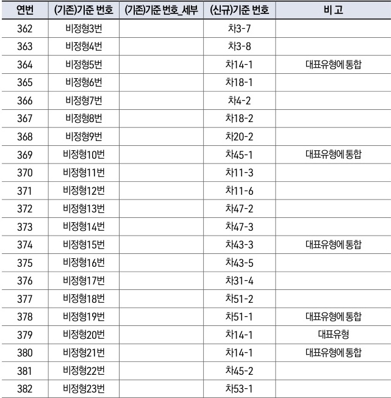

자동차사고 과실비율 인정기준 | (별첨) 변경대비표 111

| 연번  | (기존)기준 번호 | (기존)기준 번호\_세부 | (신규)기준 번호 | 비 고      |
| --- | --------- | ------------- | --------- | -------- |
| 362 | 비정형3번     |               | 차3-7      |          |
| 363 | 비정형4번     |               | 차3-8      |          |
| 364 | 비정형5번     |               | 차14-1     | 대표유형에 통합 |
| 365 | 비정형6번     |               | 차18-1     |          |
| 366 | 비정형7번     |               | 차4-2      |          |
| 367 | 비정형8번     |               | 차18-2     |          |
| 368 | 비정형9번     |               | 차20-2     |          |
| 369 | 비정형10번    |               | 차45-1     | 대표유형에 통합 |
| 370 | 비정형11번    |               | 차11-3     |          |
| 371 | 비정형12번    |               | 차11-6     |          |
| 372 | 비정형13번    |               | 차47-2     |          |
| 373 | 비정형14번    |               | 차47-3     |          |
| 374 | 비정형15번    |               | 차43-3     | 대표유형에 통합 |
| 375 | 비정형16번    |               | 차43-5     |          |
| 376 | 비정형17번    |               | 차31-4     |          |
| 377 | 비정형18번    |               | 차51-2     |          |
| 378 | 비정형19번    |               | 차51-1     | 대표유형에 통합 |
| 379 | 비정형20번    |               | 차14-1     | 대표유형     |
| 380 | 비정형21번    |               | 차14-1     | 대표유형에 통합 |
| 381 | 비정형22번    |               | 차45-2     |          |
| 382 | 비정형23번    |               | 차53-1     |          |

