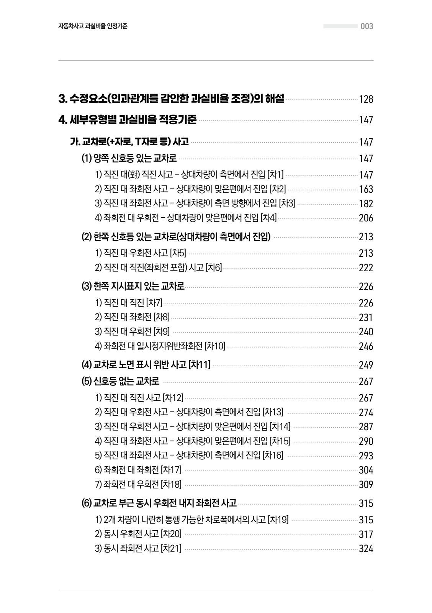
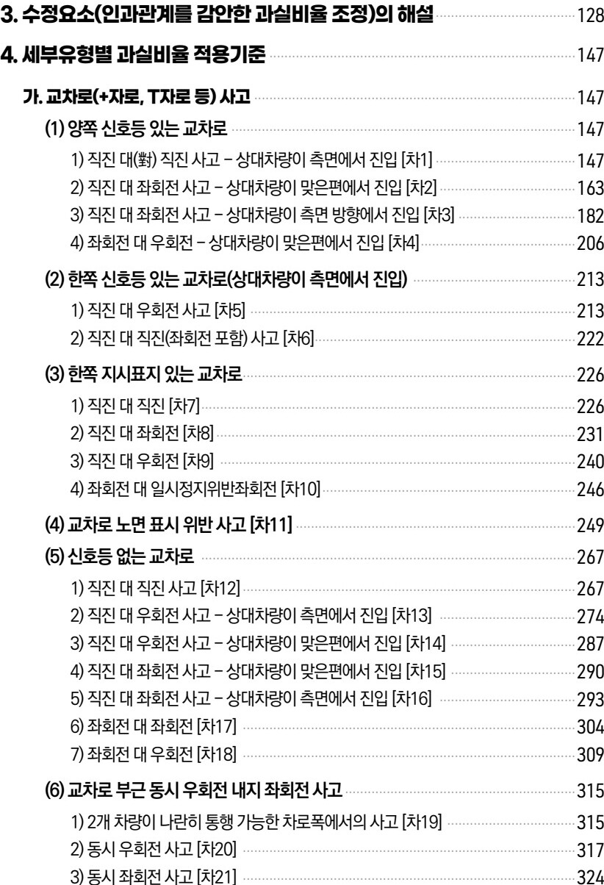
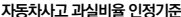
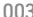

# Page 4

- source: /home/nyong/mdm/data/raw/230630_자동차사고 과실비율 인정기준_최종.pdf
- categories: text
- page_number_base: one-based

자동차사고 과실비율 인정기준 003

### 3. 수정요소(인과관계를 감안한 과실비율 조정)의 해설 ····················································· 128
### 4. 세부유형별 과실비율 적용기준 ····························································································· 147
#### 가. 교차로(+자로, T자로 등) 사고 ····························································································· 147
**(1) 양쪽 신호등 있는 교차로** ········································································································· 147
1) 직진 대(對) 직진 사고 - 상대차량이 측면에서 진입 [차1] ····················································· 147
2) 직진 대 좌회전 사고 - 상대차량이 맞은편에서 진입 [차2] ··················································· 163
3) 직진 대 좌회전 사고 - 상대차량이 측면 방향에서 진입 [차3] ············································· 182
4) 좌회전 대 우회전 - 상대차량이 맞은편에서 진입 [차4] ························································· 206

**(2) 한쪽 신호등 있는 교차로(상대차량이 측면에서 진입)** ······················································· 213
1) 직진 대 우회전 사고 [차5] ········································································································· 213
2) 직진 대 직진(좌회전 포함) 사고 [차6] ····················································································· 222

**(3) 한쪽 지시표지 있는 교차로** ····································································································· 226
1) 직진 대 직진 [차7] ······················································································································· 226
2) 직진 대 좌회전 [차8] ··················································································································· 231
3) 직진 대 우회전 [차9] ··················································································································· 240
4) 좌회전 대 일시정지위반좌회전 [차10] ····················································································· 246

**(4) 교차로 노면 표시 위반 사고 [차11]** ····················································································· 249

**(5) 신호등 없는 교차로** ··················································································································· 267
1) 직진 대 직진 사고 [차12] ········································································································· 267
2) 직진 대 우회전 사고 - 상대차량이 측면에서 진입 [차13] ····················································· 274
3) 직진 대 우회전 사고 - 상대차량이 맞은편에서 진입 [차14] ················································· 287
4) 직진 대 좌회전 사고 - 상대차량이 맞은편에서 진입 [차15] ················································· 290
5) 직진 대 좌회전 사고 - 상대차량이 측면에서 진입 [차16] ····················································· 293
6) 좌회전 대 좌회전 [차17] ············································································································· 304
7) 좌회전 대 우회전 [차18] ············································································································· 309

**(6) 교차로 부근 동시 우회전 내지 좌회전 사고** ······································································· 315
1) 2개 차량이 나란히 통행 가능한 차로폭에서의 사고 [차19] ················································· 315
2) 동시 우회전 사고 [차20] ············································································································· 317
3) 동시 좌회전 사고 [차21] ············································································································· 324

## Images

