# Page 31

- source: /home/nyong/mdm/data/raw/230630_자동차사고 과실비율 인정기준_최종.pdf
- categories: text
- page_number_base: one-based

자동차사고 과실비율 인정기준 | 제3편 사고유형별 과실비율 적용기준 030 목차

# 1. 적용 범위

이 장은 자동차와 보행자의 사고에 적용한다. 여기서 자동차는 도로교통법 제2조 제18호의 자동차에 원동기장치자전거를 포함한다. 이륜자동차 및 자전거를 타고 가는 자는 보행자로 분류하지 않고 각 이륜자동차 및 자전거 해당 사고 유형으로 적용한다. 도로교통법 제2조 제17호에 따르면 손수레·우마차는 ‘차’에 해당하며 이를 끌고 가는 행위는 운전행위에 해당한다. 따라서 도로교통법 제13조 제3항에 정해진 도로의 통행 방법에 따라 도로 우측을 통행하여야 하지만 손수레·우마차를 끌고 횡단보도를 횡단하는 경우에는 보행자로 해석한다.(자전거와 이륜차도 마찬가지이다.) 다만, 손수레·우마차를 차도로 끌고 가는 경우에는 자전거사고를 준용한다.

# 2. 용어 정의

### (1) 도로교통법 제2조 준용

1. “도로”란 다음 각 목에 해당하는 곳을 말한다.
   가. 「도로법」에 따른 도로
   나. 「유료도로법」에 따른 유료도로
   다. 「농어촌도로 정비법」에 따른 농어촌도로
   라. 그 밖에 현실적으로 불특정 다수의 사람 또는 차마(車馬)가 통행할 수 있도록 공개된 장소로서 안전하고 원활한 교통을 확보할 필요가 있는 장소

4. “차도”(車道)란 연석선(차도와 보도를 구분하는 돌 등으로 이어진 선을 말한다. 이하 같다), 안전표지 또는 그와 비슷한 인공구조물을 이용하여 경계(境界)를 표시하여 모든 차가 통행할 수 있도록 설치된 도로의 부분을 말한다.

6. “차로”란 차마가 한 줄로 도로의 정하여진 부분을 통행하도록 차선(車線)으로 구분한 차도의 부분을 말한다.

7. “차선”이란 차로와 차로를 구분하기 위하여 그 경계지점을 안전표지로 표시한 선을 말한다.

10. “보도”(步道)란 연석선, 안전표지나 그와 비슷한 인공구조물로 경계를 표시하여 보행자(유모차, 보행보조용 의자차, 노약자용 보행기 등 행정안전부령으로 정하는 기구 장치를 이용하여 통행하는 사람을 포함한다. 이하 같다)가 통행할 수 있도록 한 도로의 부분을 말한다.

제1장. 자동차와 보행자의 사고
제2장. 자동차와 자동차(이륜차 포함)의 사고
제3장. 자동차와 자전거(농기계 포함)의 사고

## Images

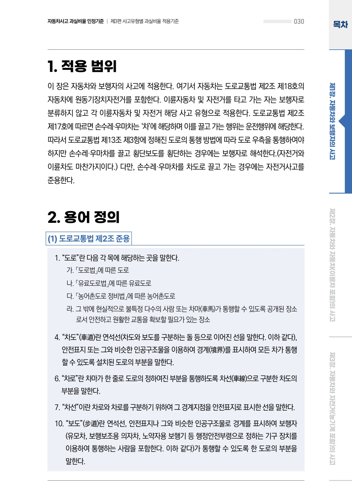

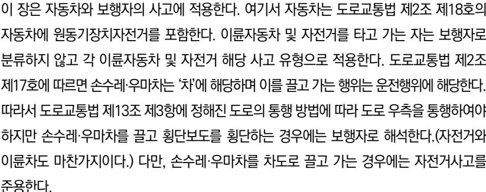

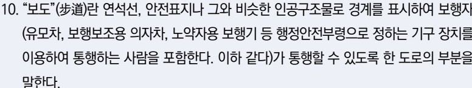

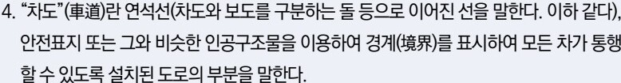

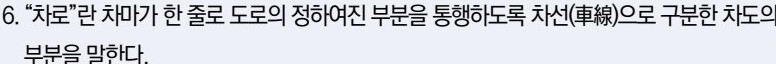

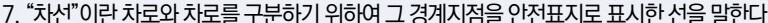

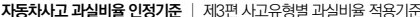

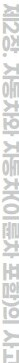

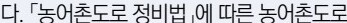

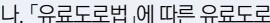

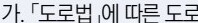

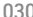

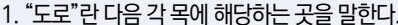

