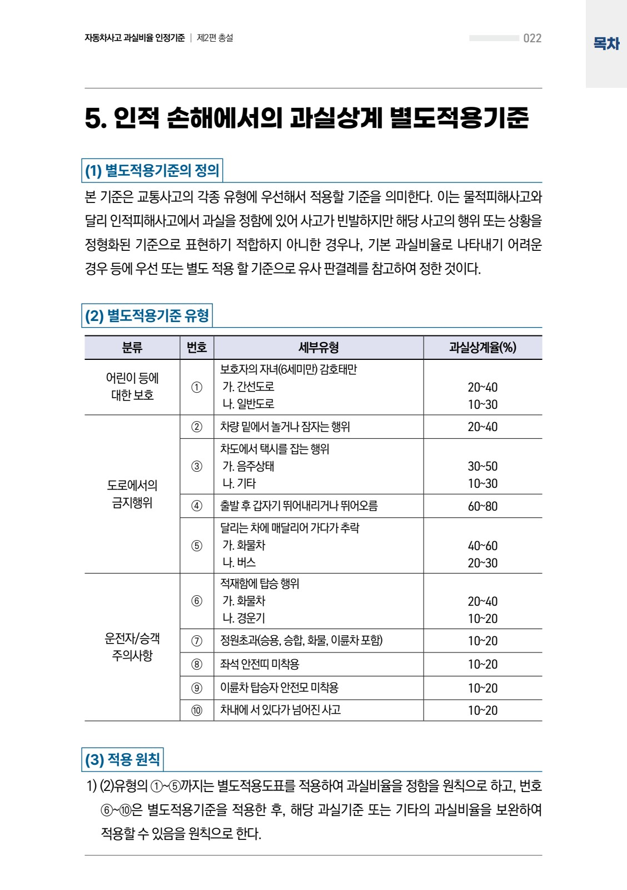
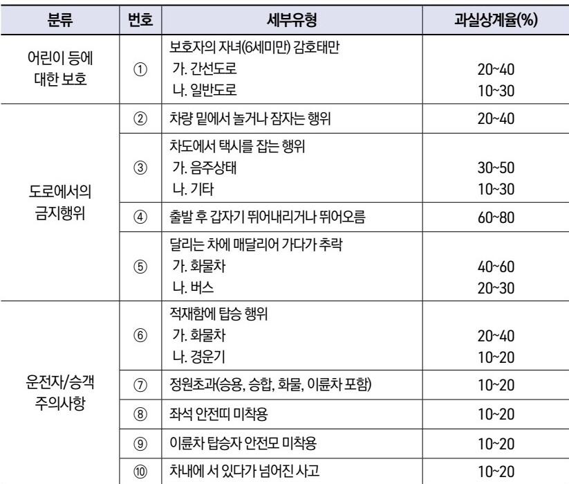
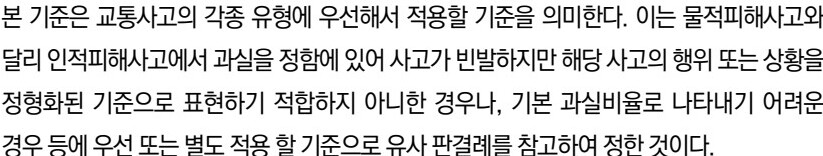
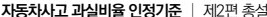
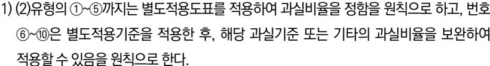

# Page 23

- source: /home/nyong/mdm/data/raw/230630_자동차사고 과실비율 인정기준_최종.pdf
- categories: table
- page_number_base: one-based

자동차사고 과실비율 인정기준 | 제2편 총설 022

# 5. 인적 손해에서의 과실상계 별도적용기준

### (1) 별도적용기준의 정의
본 기준은 교통사고의 각종 유형에 우선해서 적용할 기준을 의미한다. 이는 물적피해사고와 달리 인적피해사고에서 과실을 정함에 있어 사고가 빈발하지만 해당 사고의 행위 또는 상황을 정형화된 기준으로 표현하기 적합하지 아니한 경우나, 기본 과실비율로 나타내기 어려운 경우 등에 우선 또는 별도 적용 할 기준으로 유사 판결례를 참고하여 정한 것이다.

### (2) 별도적용기준 유형

| 분류               | 번호 | 세부유형                     | 과실상계율(%) |        |
| ---------------- | -- | ------------------------ | -------- | ------ |
| 어린이 등에 대한 보호 | ①  | 보호자의 자녀(6세미만) 감호태만       |          |        |
|                  |    |                          | 가. 간선도로  | 20\~40 |
|                  |    |                          | 나. 일반도로  | 10\~30 |
| 도로에서의 금지행위   | ②  | 차량 밑에서 놀거나 잠자는 행위        | 20\~40   |        |
|                  | ③  | 차도에서 택시를 잡는 행위           |          |        |
|                  |    |                          | 가. 음주상태  | 30\~50 |
|                  |    |                          | 나. 기타    | 10\~30 |
|                  | ④  | 출발 후 갑자기 뛰어내리거나 뛰어오름     | 60\~80   |        |
|                  | ⑤  | 달리는 차에 매달리어 가다가 추락       |          |        |
|                  |    |                          | 가. 화물차   | 40\~60 |
|                  |    | 나. 버스                    | 20\~30   |        |
| 운전자/승객 주의사항  | ⑥  | 적재함에 탑승 행위               |          |        |
|                  |    |                          | 가. 화물차   | 20\~40 |
|                  |    |                          | 나. 경운기   | 10\~20 |
|                  | ⑦  | 정원초과(승용, 승합, 화물, 이륜차 포함) | 10\~20   |        |
|                  | ⑧  | 좌석 안전띠 미착용               | 10\~20   |        |
|                  | ⑨  | 이륜차 탑승자 안전모 미착용          | 10\~20   |        |
|                  | ⑩  | 차내에 서 있다가 넘어진 사고         | 10\~20   |        |

### (3) 적용 원칙
1) (2)유형의 ①~⑤까지는 별도적용도표를 적용하여 과실비율을 정함을 원칙으로 하고, 번호 ⑥~⑩은 별도적용기준을 적용한 후, 해당 과실기준 또는 기타의 과실비율을 보완하여 적용할 수 있음을 원칙으로 한다.

## Images

