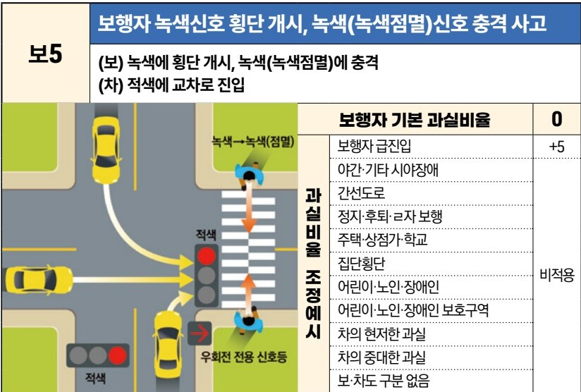
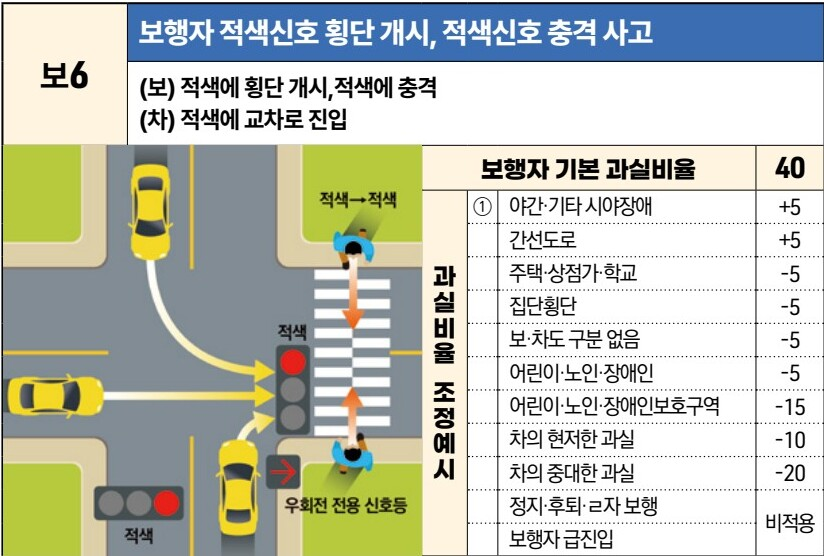

# Page 50

- source: /home/nyong/mdm/data/raw/230630_자동차사고 과실비율 인정기준_최종.pdf
- categories: image
- page_number_base: one-based

자동차사고 과실비율 인정기준 | 제3편 사고유형별 과실비율 적용기준 049 목차

### 3) 자동차 적색신호 교차로 통과 후(後) [보5~보7]

#### 보5 보행자 녹색신호 횡단 개시, 녹색(녹색점멸)신호 충격 사고
(보) 녹색에 횡단 개시, 녹색(녹색점멸)에 충격
(차) 적색에 교차로 진입

[The image shows a diagram of a four-way intersection. A yellow car is entering the intersection from the bottom against a red light. A pedestrian is crossing the crosswalk at the top of the intersection. The pedestrian signal is green/flashing green. There is also a right-turn only signal shown as red.]

|           | 보행자 기본 과실비율     | 0   |
| --------- | --------------- | --- |
| 과실비율 조정예시 | 보행자 급진입         | +5  |
| 과실비율 조정예시 | 야간·기타 시야장애      | 비적용 |
|           | 간선도로            |     |
|           | 정지·후퇴·ㄹ자 보행     |     |
|           | 주택·상점가·학교       |     |
|           | 집단횡단            |     |
|           | 어린이·노인·장애인      |     |
|           | 어린이·노인·장애인 보호구역 |     |
|           | 차의 현저한 과실       |     |
|           | 차의 중대한 과실       |     |
|           | 보·차도 구분 없음      |     |

※사고발생, 손해확대와의 인과관계를 감안하여 기본 과실비율을 가(+), 감(-) 조정 가능합니다.

#### 보6 보행자 적색신호 횡단 개시, 적색신호 충격 사고
(보) 적색에 횡단 개시, 적색에 충격
(차) 적색에 교차로 진입

[The image shows a diagram of a four-way intersection. A yellow car is entering the intersection from the bottom against a red light. A pedestrian is crossing the crosswalk at the top of the intersection. The pedestrian signal is red. There is also a right-turn only signal shown as red.]

|           | 보행자 기본 과실비율    | 40  |
| --------- | -------------- | --- |
| 과실비율 조정예시 | ① 야간·기타 시야장애   | +5  |
|           | 간선도로           | +5  |
|           | 주택·상점가·학교      | -5  |
|           | 집단횡단           | -5  |
|           | 보·차도 구분 없음     | -5  |
|           | 어린이·노인·장애인     | -5  |
|           | 어린이·노인·장애인보호구역 | -15 |
|           | 차의 현저한 과실      | -10 |
|           | 차의 중대한 과실      | -20 |
|           | 정지·후퇴·ㄹ자 보행    | 비적용 |
|           | 보행자 급진입        |     |

※사고발생, 손해확대와의 인과관계를 감안하여 기본 과실비율을 가(+), 감(-) 조정 가능합니다.

제1장. 자동차와 보행자의 사고
제2장. 자동차와 자동차(이륜차 포함)의 사고
제3장. 자동차와 자전거(농기계 포함)의 사고

## Images

