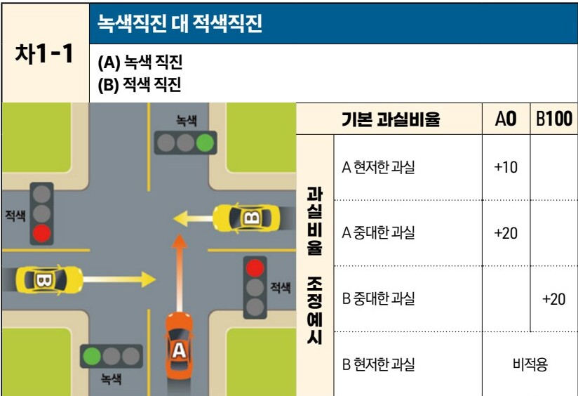
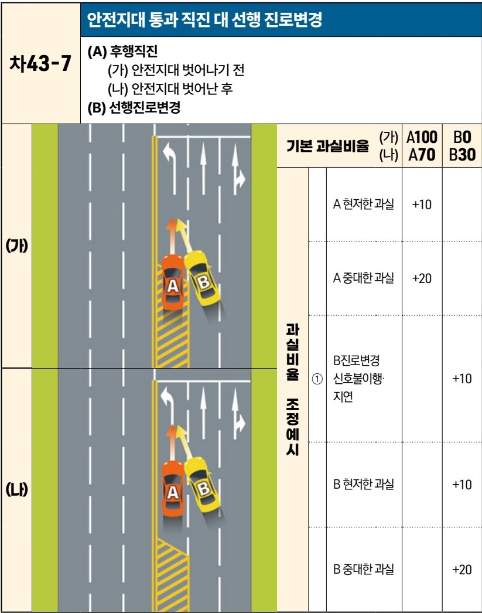

# LlamaParse Combined Results

- source: /home/nyong/mdm/data/raw/230630_자동차사고 과실비율 인정기준_최종.pdf

---

# Page 4

- categories: text

자동차사고 과실비율 인정기준 003

### 3. 수정요소(인과관계를 감안한 과실비율 조정)의 해설 ····················································· 128
### 4. 세부유형별 과실비율 적용기준 ····························································································· 147
#### 가. 교차로(+자로, T자로 등) 사고 ····························································································· 147
##### (1) 양쪽 신호등 있는 교차로 ····································································································· 147
1) 직진 대(對) 직진 사고 - 상대차량이 측면에서 진입 [차1] ····················································· 147
2) 직진 대 좌회전 사고 - 상대차량이 맞은편에서 진입 [차2] ··················································· 163
3) 직진 대 좌회전 사고 - 상대차량이 측면 방향에서 진입 [차3] ············································· 182
4) 좌회전 대 우회전 - 상대차량이 맞은편에서 진입 [차4] ························································· 206
##### (2) 한쪽 신호등 있는 교차로(상대차량이 측면에서 진입) ····················································· 213
1) 직진 대 우회전 사고 [차5] ········································································································· 213
2) 직진 대 직진(좌회전 포함) 사고 [차6] ····················································································· 222
##### (3) 한쪽 지시표지 있는 교차로 ································································································· 226
1) 직진 대 직진 [차7] ······················································································································· 226
2) 직진 대 좌회전 [차8] ··················································································································· 231
3) 직진 대 우회전 [차9] ··················································································································· 240
4) 좌회전 대 일시정지위반좌회전 [차10] ····················································································· 246
##### (4) 교차로 노면 표시 위반 사고 [차11] ··················································································· 249
##### (5) 신호등 없는 교차로 ················································································································· 267
1) 직진 대 직진 사고 [차12] ··········································································································· 267
2) 직진 대 우회전 사고 - 상대차량이 측면에서 진입 [차13] ··················································· 274
3) 직진 대 우회전 사고 - 상대차량이 맞은편에서 진입 [차14] ··············································· 287
4) 직진 대 좌회전 사고 - 상대차량이 맞은편에서 진입 [차15] ··············································· 290
5) 직진 대 좌회전 사고 - 상대차량이 측면에서 진입 [차16] ··················································· 293
6) 좌회전 대 좌회전 [차17] ············································································································· 304
7) 좌회전 대 우회전 [차18] ············································································································· 309
##### (6) 교차로 부근 동시 우회전 내지 좌회전 사고 ····································································· 315
1) 2개 차량이 나란히 통행 가능한 차로폭에서의 사고 [차19] ··············································· 315
2) 동시 우회전 사고 [차20] ············································································································· 317
3) 동시 좌회전 사고 [차21] ············································································································· 324

---

# Page 9

- categories: text

자동차사고 과실비율 인정기준 | 발간사 008

특히 금번 제10차 개정판에서는 과실비율 인정기준의 공정성과 합리성을 높이는 것 뿐만 아니라, 다양한 데이터 분석과 의견수렴 과정을 토대로 국민들의 눈높이에 걸맞는 인정기준으로 거듭나기 위해 노력하였습니다.

이를 위해 과실비율 분쟁 심의 데이터 분석(서울대학교), 소비자 및 보험전문가 대상 설문조사, 관계당국 및 법조계, 학계 공동의 협의체 운영 등을 진행하였고, 법률전문가 컨소시엄을 통해 심도있는 연구를 거쳐 금번 개정판을 마련하였습니다. 또한, 국민들이 보다 쉽게 접근할 수 있도록 분류 체계를 개편하고 용어를 순화하였으며, 활용도가 낮거나 분쟁 소지가 있는 기준은 정비·개선하여 인정기준의 공정성과 합리성을 제고하였습니다.

동 과실비율 인정기준이 교통사고 시 과실비율을 보다 쉽게 이해하고 판단하는 참고기준으로 널리 활용되길 바랍니다. 이를 통해 우리 사회의 법적 안정성 및 형평성을 확보하고, 교통사고로 인한 분쟁 감소 뿐만 아니라 예측 가능한 교통 환경을 만들어 교통사고가 감소하는데도 도움이 되기를 기대합니다.

인정기준 개정을 위해 많은 분들의 도움을 받았으며 그 기대에 부응하기 위해 최선을 다하였습니다. 자동차사고 과실비율분쟁 심의위원회는 앞으로도 과실비율에 대한 심도 있는 연구와 논의를 통해 인정기준을 더욱 발전시켜 나갈 수 있도록 노력하겠습니다.

마지막으로 동 인정기준 마련을 위해 애써주신 연구진 및 관계자 분들과 교통사고 및 분쟁 처리를 위해 힘쓰고 계신 경찰, 검찰, 법원 및 보험사·공제사 임직원 여러분, 소비자보호 및 제도개선을 위해 힘쓰고 계신 금융당국 관계자 여러분, 그리고 더 안전한 대한민국을 만들기 위해 각자의 자리에서 노력하고 계신 국민 여러분께 감사와 존경을 담아 인사 올립니다. 감사합니다.

자동차사고 과실비율분쟁 심의위원장
**서 영 종**

---

# Page 23

- categories: table

자동차사고 과실비율 인정기준 | 제2편 총설 022

# 5. 인적 손해에서의 과실상계 별도적용기준

### (1) 별도적용기준의 정의
본 기준은 교통사고의 각종 유형에 우선해서 적용할 기준을 의미한다. 이는 물적피해사고와 달리 인적피해사고에서 과실을 정함에 있어 사고가 빈발하지만 해당 사고의 행위 또는 상황을 정형화된 기준으로 표현하기 적합하지 아니한 경우나, 기본 과실비율로 나타내기 어려운 경우 등에 우선 또는 별도 적용 할 기준으로 유사 판결례를 참고하여 정한 것이다.

### (2) 별도적용기준 유형

| 분류               | 번호 | 세부유형                     | 과실상계율(%) |        |
| ---------------- | -- | ------------------------ | -------- | ------ |
| 어린이 등에 대한 보호 | ①  | 보호자의 자녀(6세미만) 감호태만       |          |        |
|                  |    |                          | 가. 간선도로  | 20\~40 |
|                  |    |                          | 나. 일반도로  | 10\~30 |
| 도로에서의 금지행위   | ②  | 차량 밑에서 놀거나 잠자는 행위        | 20\~40   |        |
|                  | ③  | 차도에서 택시를 잡는 행위           |          |        |
|                  |    |                          | 가. 음주상태  | 30\~50 |
|                  |    |                          | 나. 기타    | 10\~30 |
|                  | ④  | 출발 후 갑자기 뛰어내리거나 뛰어오름     | 60\~80   |        |
|                  | ⑤  | 달리는 차에 매달리어 가다가 추락       |          |        |
|                  |    |                          | 가. 화물차   | 40\~60 |
|                  |    | 나. 버스                    | 20\~30   |        |
| 운전자/승객 주의사항  | ⑥  | 적재함에 탑승 행위               |          |        |
|                  |    |                          | 가. 화물차   | 20\~40 |
|                  |    |                          | 나. 경운기   | 10\~20 |
|                  | ⑦  | 정원초과(승용, 승합, 화물, 이륜차 포함) | 10\~20   |        |
|                  | ⑧  | 좌석 안전띠 미착용               | 10\~20   |        |
|                  | ⑨  | 이륜차 탑승자 안전모 미착용          | 10\~20   |        |
|                  | ⑩  | 차내에 서 있다가 넘어진 사고         | 10\~20   |        |

### (3) 적용 원칙
1) (2)유형의 ①~⑤까지는 별도적용도표를 적용하여 과실비율을 정함을 원칙으로 하고, 번호 ⑥~⑩은 별도적용기준을 적용한 후, 해당 과실기준 또는 기타의 과실비율을 보완하여 적용할 수 있음을 원칙으로 한다.

---

# Page 31

- categories: text

자동차사고 과실비율 인정기준 | 제3편 사고유형별 과실비율 적용기준 030

# 1. 적용 범위

이 장은 자동차와 보행자의 사고에 적용한다. 여기서 자동차는 도로교통법 제2조 제18호의 자동차에 원동기장치자전거를 포함한다. 이륜자동차 및 자전거를 타고 가는 자는 보행자로 분류하지 않고 각 이륜자동차 및 자전거 해당 사고 유형으로 적용한다. 도로교통법 제2조 제17호에 따르면 손수레·우마차는 ‘차’에 해당하며 이를 끌고 가는 행위는 운전행위에 해당한다. 따라서 도로교통법 제13조 제3항에 정해진 도로의 통행 방법에 따라 도로 우측을 통행하여야 하지만 손수레·우마차를 끌고 횡단보도를 횡단하는 경우에는 보행자로 해석한다.(자전거와 이륜차도 마찬가지이다.) 다만, 손수레·우마차를 차도로 끌고 가는 경우에는 자전거사고를 준용한다.

# 2. 용어 정의

### (1) 도로교통법 제2조 준용

1. “도로”란 다음 각 목에 해당하는 곳을 말한다.
   가. 「도로법」에 따른 도로
   나. 「유료도로법」에 따른 유료도로
   다. 「농어촌도로 정비법」에 따른 농어촌도로
   라. 그 밖에 현실적으로 불특정 다수의 사람 또는 차마(車馬)가 통행할 수 있도록 공개된 장소로서 안전하고 원활한 교통을 확보할 필요가 있는 장소

4. “차도”(車道)란 연석선(차도와 보도를 구분하는 돌 등으로 이어진 선을 말한다. 이하 같다), 안전표지 또는 그와 비슷한 인공구조물을 이용하여 경계(境界)를 표시하여 모든 차가 통행할 수 있도록 설치된 도로의 부분을 말한다.

6. “차로”란 차마가 한 줄로 도로의 정하여진 부분을 통행하도록 차선(車線)으로 구분한 차도의 부분을 말한다.

7. “차선”이란 차로와 차로를 구분하기 위하여 그 경계지점을 안전표지로 표시한 선을 말한다.

10. “보도”(步道)란 연석선, 안전표지나 그와 비슷한 인공구조물로 경계를 표시하여 보행자(유모차, 보행보조용 의자차, 노약자용 보행기 등 행정안전부령으로 정하는 기구 장치를 이용하여 통행하는 사람을 포함한다. 이하 같다)가 통행할 수 있도록 한 도로의 부분을 말한다.

제1장. 자동차와 보행자의 사고

---

# Page 32

- categories: text

자동차사고 과실비율 인정기준 | 제3편 사고유형별 과실비율 적용기준 031

11. “길가장자리구역”이란 보도와 차도가 구분되지 아니한 도로에서 보행자의 안전을 확보하기 위하여 안전표지 등으로 경계를 표시한 도로의 가장자리 부분을 말한다.

12. “횡단보도”란 보행자가 도로를 횡단할 수 있도록 안전표지로 표시한 도로의 부분을 말한다.

13. “교차로”란 ‘十’자로, ‘T’자로나 그 밖에 둘 이상의 도로(보도와 차도가 구분되어 있는 도로 에서는 차도를 말한다)가 교차하는 부분을 말한다.

15. “신호기”란 도로교통에서 문자·기호 또는 등화(燈火)를 사용하여 진행·정지·방향전환·주의 등의 신호를 표시하기 위하여 사람이나 전기의 힘으로 조작하는 장치를 말한다.

18. “자동차”란 철길이나 가설된 선을 이용하지 아니하고 원동기를 사용하여 운전되는 차(견인되는 자동차도 자동차의 일부로 본다)로서 다음 각 목의 차를 말한다.
    가. 「자동차관리법」 제3조에 따른 다음의 자동차. 다만, 원동기장치자전거는 제외한다.
        1) 승용자동차
        2) 승합자동차
        3) 화물자동차
        4) 특수자동차
        5) 이륜자동차
    나. 「건설기계관리법」 제26조제1항 단서에 따른 건설기계

18의2. “자율주행시스템”이란 「자율주행자동차 상용화 촉진 및 지원에 관한 법률」 제2조 제1항 제2호에 따른 자율주행시스템을 말한다. 이 경우 그 종류는 완전 자율주행시스템, 부분 자율주행시스템 등 행정안전부령으로 정하는 바에 따라 세분할 수 있다.

18의3. “자율주행자동차”란 「자동차관리법」 제2조 제1호의 3에 따른 자율주행자동차로서 자율주행시스템을 갖추고 있는 자동차를 말한다.

24. “주차”란 운전자가 승객을 기다리거나 화물을 싣거나 차가 고장 나거나 그 밖의 사유로 차를 계속 정지 상태에 두는 것 또는 운전자가 차에서 떠나서 즉시 그 차를 운전할 수 없는 상태에 두는 것을 말한다.

25. “정차”란 운전자가 5분을 초과하지 아니하고 차를 정지시키는 것으로서 주차 외의 정지 상태를 말한다.

26. “운전”이란 도로(제27조제6항제3호·제44조·제45조·제54조제1항·제148조·제148조의 2 및 제156조 제10호의 경우에는 도로 외의 곳을 포함한다)에서 차마 또는 노면전차를 그 본래의 사용 방법에 따라 사용하는 것(조종 또는 자율주행시스템을 사용하는 것을 포함한다)을 말한다.

# 제1장. 자동차와 보행자의 사고

목차
제1장. 자동차와 보행자의 사고
제2장. 자동차와 자동차(이륜차 포함)의 사고
제3장. 자동차와 자전거(농기계 포함)의 사고

---

# Page 34

- categories: table

자동차사고 과실비율 인정기준 | 제3편 사고유형별 과실비율 적용기준 033 **목차**

<u>**(4) 교통정리가 이루어지는 교차로, 교통정리가 이루어지지 않는 교차로**</u>
- 도로교통법 제5조에 따라 신호기 등에 의해 교통정리가 이루어지는 교차로에서는 신호기의 신호가 우선한다.(한쪽 방향에만 신호기가 있는 경우도 동일하다.)
- 양 차량의 진행방향에 신호기가 둘 다 적색 점멸이거나 황색 점멸인 경우에는 교통정리가 이루어지지 않는 교차로로 판단한다.

# 3. 수정요소(인과관계를 감안한 과실비율 조정)의 해설

<u>**(1) 야간, 기타 시야장애, 차의 등화 및 감속**</u>
- “야간”은 일몰 후부터 일출 전까지를 말하며, ‘기타 시야장애’란 야간 개념을 제외하고 상대 차량이 보행자의 존재를 쉽게 인식할 수 없는 경우를 말한다.
- (보행자의 과실 가산) 차량의 바로 앞뒤 또는 심한 오르막이나 커브길·골목길 등에서 보행자가 갑자기 튀어나옴으로써 운전자가 사고 이전에 보행자의 유무를 알 수 없었던 경우 혹은 사고 당시 보행자가 검은색 계열의 의복을 착용하여 쉽게 자동차 운전자가 식별하기 어려운 경우 등은 보행자의 과실을 가산할 수 있다. 야간에는 보행자가 차량의 전조등을 켠 차의 발견이 용이하지만 운전자는 보행자의 발견이 쉽지 않기 때문이다. 방호울타리(가드레일, 중앙 분리대) 등 횡단을 제한하는 시설이 설치되어 있는 곳에서 무리하게 보행하다가 사고를 당한 경우, 지하차도 출입구 및 고가도로 출입구를 보행하는 경우에도 보행자의 과실을 가산할 수 있다.
- (자동차의 과실 가산) 도로교통법 제37조에 정해진 차량의 등화 의무를 게을리 한 경우에는 자동차의 과실을 가산할 수 있다.
- (비적용) 보행자가 횡단보도를 횡단하거나 신호기 또는 경찰공무원의 신호에 따라 차 앞

> **도로교통법 제10조(도로의 횡단)**
> ④ 보행자는 차와 노면전차의 바로 앞이나 뒤로 횡단하여서는 아니 된다. 다만, 횡단보도를 횡단하거나 신호기 또는 경찰공무원등의 신호나 지시에 따라 도로를 횡단하는 경우에는 그러하지 아니하다.
>
> **도로교통법 제37조(차와 노면전차의 등화)**
> ① 모든 차 또는 노면전차의 운전자는 다음 각 호의 어느 하나에 해당하는 경우에는 대통령령으로 정하는 바에 따라 전조등(前照燈), 차폭등(車幅燈), 미등(尾燈)과 그 밖의 등화를 켜야 한다.
> 1. 밤(해가 진 후부터 해가 뜨기 전까지를 말한다. 이하 같다)에 도로에서 차 또는 노면전차를 운행하거나 고장이나 그 밖의 부득이한 사유로 도로에서 차 또는 노면전차를 정차 또는 주차하는 경우

제1장. 자동차와 보행자의 사고
제2장. 자동차와 자동차(이륜차 포함)의 사고
제3장. 자동차와 자전거(농기계 포함)의 사고

---

# Page 50

- categories: image

자동차사고 과실비율 인정기준 | 제3편 사고유형별 과실비율 적용기준 049 목차

### 3) 자동차 적색신호 교차로 통과 후(後) [보5~보7]

#### 보5 보행자 녹색신호 횡단 개시, 녹색(녹색점멸)신호 충격 사고
(보) 녹색에 횡단 개시, 녹색(녹색점멸)에 충격
(차) 적색에 교차로 진입

[The image shows a diagram of a four-way intersection. A yellow car is entering the intersection from the bottom against a red light. A pedestrian is crossing the crosswalk at the top of the intersection. The pedestrian signal is green/flashing green. There is also a right-turn only signal shown as red.]

|           | 보행자 기본 과실비율     | 0   |
| --------- | --------------- | --- |
| 과실비율 조정예시 | 보행자 급진입         | +5  |
| 과실비율 조정예시 | 야간·기타 시야장애      | 비적용 |
|           | 간선도로            |     |
|           | 정지·후퇴·ㄹ자 보행     |     |
|           | 주택·상점가·학교       |     |
|           | 집단횡단            |     |
|           | 어린이·노인·장애인      |     |
|           | 어린이·노인·장애인 보호구역 |     |
|           | 차의 현저한 과실       |     |
|           | 차의 중대한 과실       |     |
|           | 보·차도 구분 없음      |     |

※사고발생, 손해확대와의 인과관계를 감안하여 기본 과실비율을 가(+), 감(-) 조정 가능합니다.

#### 보6 보행자 적색신호 횡단 개시, 적색신호 충격 사고
(보) 적색에 횡단 개시, 적색에 충격
(차) 적색에 교차로 진입

[The image shows a diagram of a four-way intersection. A yellow car is entering the intersection from the bottom against a red light. A pedestrian is crossing the crosswalk at the top of the intersection. The pedestrian signal is red. There is also a right-turn only signal shown as red.]

|           | 보행자 기본 과실비율    | 40  |
| --------- | -------------- | --- |
| 과실비율 조정예시 | ① 야간·기타 시야장애   | +5  |
|           | 간선도로           | +5  |
|           | 주택·상점가·학교      | -5  |
|           | 집단횡단           | -5  |
|           | 보·차도 구분 없음     | -5  |
|           | 어린이·노인·장애인     | -5  |
|           | 어린이·노인·장애인보호구역 | -15 |
|           | 차의 현저한 과실      | -10 |
|           | 차의 중대한 과실      | -20 |
|           | 정지·후퇴·ㄹ자 보행    | 비적용 |
|           | 보행자 급진입        |     |

※사고발생, 손해확대와의 인과관계를 감안하여 기본 과실비율을 가(+), 감(-) 조정 가능합니다.

제1장. 자동차와 보행자의 사고
제2장. 자동차와 자동차(이륜차 포함)의 사고
제3장. 자동차와 자전거(농기계 포함)의 사고

## Images

---

# Page 148

- categories: image

자동차사고 과실비율 인정기준 | 제3편 사고유형별 과실비율 적용기준 147 **목차**

# 4. 세부유형별 과실비율 적용기준
## 가. 교차로(+자로, T자로 등) 사고
### (1) 양쪽 신호등 있는 교차로
#### 1) 직진 대(對) 직진 사고 - 상대차량이 측면에서 진입 [차1]

| 차1-1 차1-1 | 녹색직진 대 적색직진 (A) 녹색 직진(B) 적색 직진 교차로 사고 상황도 (A차량 녹색 신호 직진, B차량 적색 신호 직진 및 충돌 상황) | 녹색직진 대 적색직진 (A) 녹색 직진(B) 적색 직진 과실비율 조정예시 | 녹색직진 대 적색직진 (A) 녹색 직진(B) 적색 직진 기본 과실비율 A 현저한 과실 A 중대한 과실 B 중대한 과실 B 현저한 과실 | 녹색직진 대 적색직진 (A) 녹색 직진(B) 적색 직진 A0 +10 +20비적용 | 녹색직진 대 적색직진 (A) 녹색 직진(B) 적색 직진 B100+20 |
| ------------- | -------------------------------------------------------------------------------------- | ------------------------------------------------ | -------------------------------------------------------------------------------------------------- | ------------------------------------------------------------ | ---------------------------------------------- |

※사고발생, 손해확대와의 인과관계를 감안하여 기본 과실비율을 가(+), 감(-) 조정 가능합니다.
※舊 201, 301, 302 기준

### 사고 상황
* 신호기에 의해 교통정리가 이루어지고 있는 교차로에서 서로 다른 도로를 이용하여 녹색 신호에 교차로에 진입하여 직진 중인 A차량과 적색신호에 교차로에 진입하여 직진 중인 B차량이 충돌한 사고이다.

제2장. 자동차와 자동차(이륜차 포함)의 사고

## Images

---

# Page 389

- categories: image

자동차사고 과실비율 인정기준 | 제3편 사고유형별 과실비율 적용기준 388 목차

## 차43-7 안전지대 통과 직진 대 선행 진로변경
**(A) 후행직진**
(가) 안전지대 벗어나기 전
(나) 안전지대 벗어난 후
**(B) 선행진로변경**

|     | 기본 과실비율   | 기본 과실비율          | 기본 과실비율 | 기본 과실비율 | (가) A100 (나) A70 | B0 B30 | B0 B30 | B0 B30 | B0 B30 |
| --- | --------- | ---------------- | ------- | ------- | -------------------- | ---------- | ---------- | ---------- | ---------- |
| (가) | 과실비율 조정예시 | A 현저한 과실         |         | +10     |                      |            |            |            |            |
|     |           | A 중대한 과실         |         | +20     |                      |            |            |            |            |
|     |           | B진로변경 ① 신호불이행·지연 |         | +10     |                      |            |            |            |            |
|     |           |                  |         |         | (나)                  | B 현저한 과실   |            |            | +10        |
|     |           | B 중대한 과실         |         |         | +20                  |            |            |            |            |

※사고발생, 손해확대와의 인과관계를 감안하여 기본 과실비율을 가(+), 감(-) 조정 가능합니다.
※舊 252-4, 388-2, 389-2 기준

제2장. 자동차와 자동차(이륜차 포함)의 사고

## Images

---

# Page 583

- categories: table

자동차사고 과실비율 인정기준 | 제3편 사고유형별 과실비율 적용기준 095

### ◉ 도로교통법 시행규칙 별표2(신호기가 표시하는 신호의 종류 및 신호의 뜻)

| 구분         | 신호의 종류    | 신호의 뜻  |                                                                                                                                                           |
| ---------- | --------- | ------ | --------------------------------------------------------------------------------------------------------------------------------------------------------- |
| 차량 신호등 | 원형 등화 | 녹색의 등화 | 1. 차마는 직진 또는 우회전할 수 있다. 2. 비보호좌회전표지 또는 비보호좌회전표시가 있는 곳에서는 좌회전할 수 있다.                                                                                   |
|            |           | 황색의 등화 | 1. 차마는 정지선이 있거나 횡단보도가 있을 때에는 그 직전이나 교차로의 직전에 정지하여야 하며, 이미 교차로에 차마의 일부라도 진입한 경우에는 신속히 교차로 밖으로 진행하여야 한다. 2. 차마는 우회전할 수 있고 우회전하는 경우에는 보행자의 횡단을 방해하지 못한다. |
|            |           | 적색의 등화 | 차마는 정지선, 횡단보도 및 교차로의 직전에서 정지하여야 한다. 다만, 신호에 따라 진행하는 다른 차마의 교통을 방해하지 아니하고 우회전할 수 있다.                                                                       |

**비고**
3. 자전거등을 주행하는 경우 자전거주행신호등이 설치되지 않은 장소에서는 차량신호등의 지시에 따른다.
4. 자전거횡단도에 자전거횡단신호등이 설치되지 않은 경우 자전거등은 보행신호등의 지시에 따른다. 이 경우 보행신호등란의 “보행자”는 “자전거등”으로 본다.

제3장. 자동차와 자전거(농기계 포함)의 사고

---

# Page 588

- categories: table

자동차사고 과실비율 인정기준 | (별첨) 변경대비표 100

# ※ (별첨) 변경대비표

| 연번 | (기존)기준 번호 | (기존)기준 번호\_세부 | (신규)기준 번호 | 비 고 |
| -- | --------- | ------------- | --------- | --- |
| 1  | 101       |               | 보1        |     |
| 2  | 102       |               | 보2        |     |
| 3  | 103       |               | 보3        |     |
| 4  | 104       |               | 보4        |     |
| 5  | 105       |               | 보5        |     |
| 6  | 106       |               | 보6        |     |
| 7  | 107       |               | 보7        |     |
| 8  | 108       |               | 보8        |     |
| 9  | 109       |               | 보9        |     |
| 10 | 110       |               | 보10       |     |
| 11 | 111       |               | 보11       |     |
| 12 | 112       |               | 보12       |     |
| 13 | 113       |               | 보13       |     |
| 14 | 114       |               | 보14       |     |
| 15 | 115       |               | 보15       |     |
| 16 | 116       |               | 보16       |     |
| 17 | 117       |               | 보17       |     |
| 18 | 118       |               | 보18       |     |
| 19 | 119       |               | 보19       |     |
| 20 | 120       |               | 보20       |     |
| 21 | 121       |               | 보21       |     |
| 22 | 122       |               | 보22       |     |
| 23 | 123       |               | 보23       |     |
| 24 | 124       |               | 보24       |     |
| 25 | 125       |               | 보25       |     |
| 26 | 126       |               | 보26       |     |
| 27 | 127       |               | 보27-2     |     |
| 28 | 비정형127-1  |               | 보27-1     |     |
| 29 | 128       |               | 보28       |     |
| 30 | 129       |               | 보29-1     |     |
| 31 | 비정형129-1  |               | 보29-2     |     |
